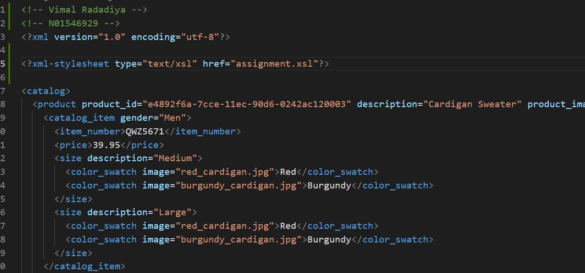
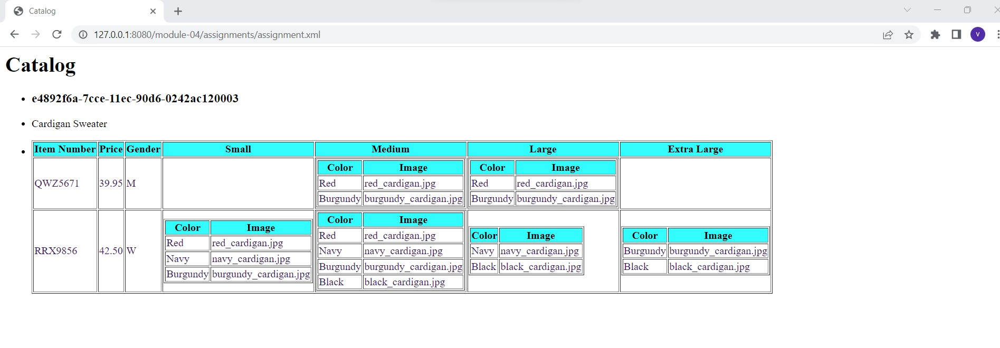

# Assignment(module_4)
# Name : Vimal Radadiya
# ID: n01546929

1. Open `module-4/assignments/assignment.xml` in your editor
2. Create xsl file and add link to it
3. Display catalog in the following way

- main title is "Catalog"
- use html list tag to display catalog
- render each item as `<article>` inside list item tag
- display product id as h3
- display product description as paragraph
- render table of catalog items with columns: item number, price, gender, small, medium, large, extra large (if column item is not present in item, then display empty cell)
- for gender column render M for Men, W for Women
- inside size columns (small, medium, large, and extra large) display subtable with 2 columns: color and image

## Ans 1,2 and 3:
## Screenshots

## Thougth Process:
-> Here in this assignment, first i tried to visual the output and started creating tags and making html element display the all details
->After that,implementing the templates with conditions and while doing this I came to know about new things like "For each" and "IF" in xsl file.
->At last, I think this type of questions require lots of hands on practice.

