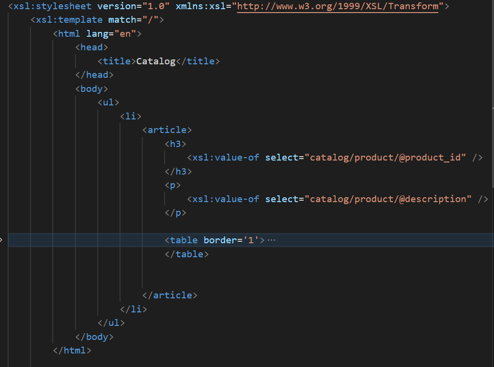

# Module04 - Assignment

- Q2: Create xsl file and add link to it

  - Creates a `.xsl` file: `/assignment.xsl`

  - In `.xml` file add `<?xml-stylesheet href="assignment.xsl" type="text/xsl"?>`

---

- Q3.1: main title is "Catalog"

      - Creates title with `<title>` tag

  

---

- Q3.2: use html list tag to display catalog
- Q3.3: render each item as `<article>` inside list item tag

  - Creates a `<ul>` tag, embeded with `<article>` tag

  

---

- Q3.4: display product id as h3
- Q3.5: display product description as paragraph

  1. Analyzes the outline of xml
  2. displays product in tag `<h3>`, with xsl tag `<xsl:value-of>`. Sets `select` attribute as `catalog/product/@product_id`.
  3. displays product in tag `
`, with xsl tag `<xsl:value-of>`. Sets `select` attribute as `catalog/product/@description`.

  

  ***

- Q3.6: render table of catalog items with columns: item number, price, gender, small, medium, large, extra large (if column item is not present in item, then display empty cell)

  1. Creates a table with `<table>` tag
  2. Uses `xsl:for-each` to loop catalog item

  

  3. Uses `xsl:if` tag to display content when item is presented.

  

---

- Q3.7: for gender column render M for Men, W for Women

  - Uses `xsl:choose` tag to diplay gender

  

---

- Q3.8: inside size columns (small, medium, large, and extra large) display subtable with 2 columns: color and image

  - Creates a table with `<table>` tag
  - Uses `xsl:for-each` to loop color_swatch elements

  

---

- Output in Browser:

