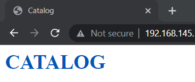
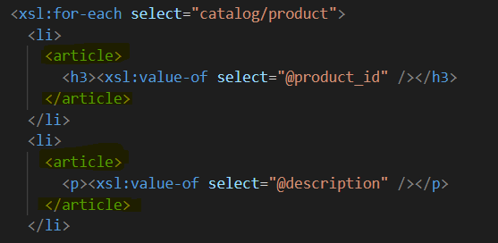
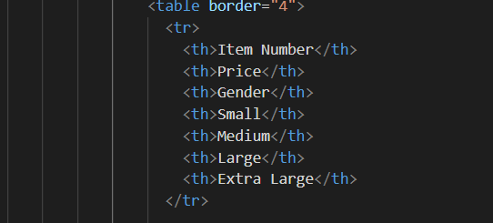

# Assignment

1. Open `module-4/assignments/assignment.xml` in your editor
2. Create xsl file and add link to it

3. Display catalog in the following way

- main title is "Catalog"

- use html list tag to display catalog

- render each item as `<article>` inside list item tag
- display product id as h3

x
- display product description as paragraph

- render table of catalog items with columns: item number, price, gender, small, medium, large, extra large (if column item is not present in item, then display empty cell)

- for gender column render M for Men, W for Women

- inside size columns (small, medium, large, and extra large) display subtable with 2 columns: color and image

