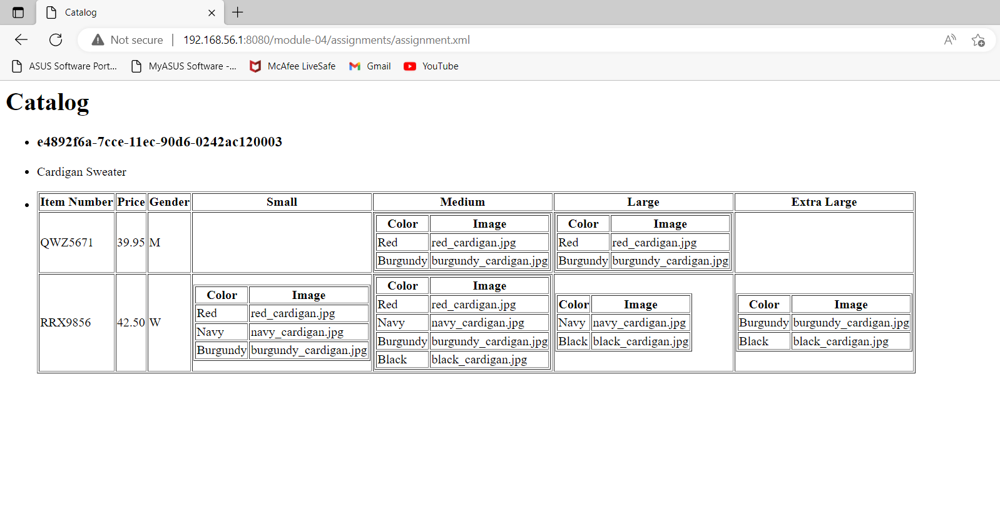

Name: Jaikumar Anilkumar Darji
ID: n01561627

Output: 

Answer: -XSL file used to find information from XML file, it will convert source document in result, 
        -In XSL templates are used to change convert xml data in html data.
        -Templates are used with different conditions like "For each","If" etc.