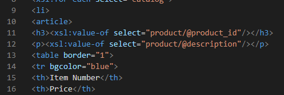
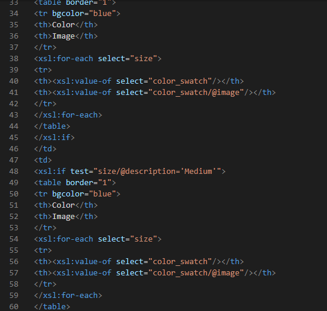
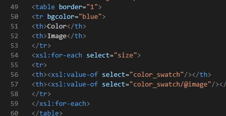

xml and xsl files are linked through href attribute
added title catalog using list tags.

product id is displayed using xsl attribute.

used - :"for each loop" in catalog to select  required

another template was used to display the subtable
