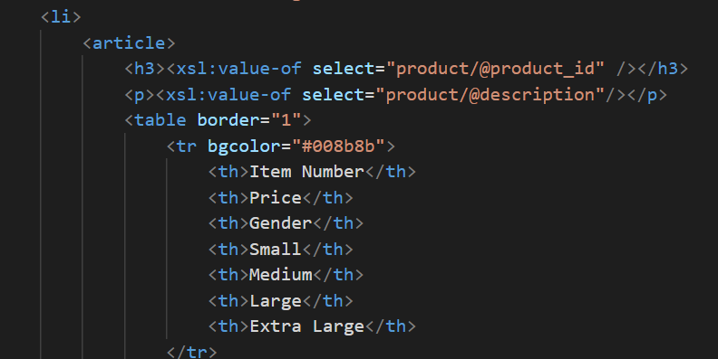
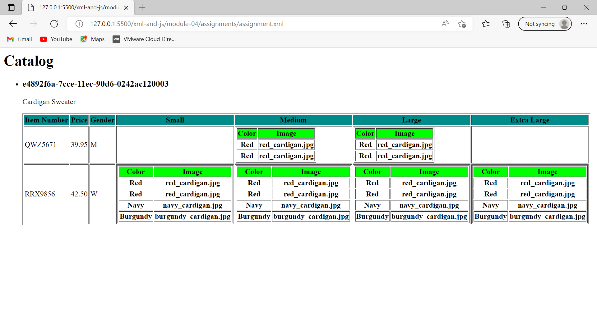

main title is "Catalog"   

- The xml version declaration and stylesheet namespace were added.
- Added a template to match the document's root 
- Added the primary title "Catalog" inside the template

A list tag has been added to display the catalogue - <article>
-Each list item uses a tag, and the product id is presented as a h3 using xsl: Using xsl:value-of
-Using xsl:value-of, the value-of - description is shown as a paragraph.

render table of catalog items with columns: item number, price, gender, small, medium, large, extra large (if column item is not present in item, then display empty cell)   
- Looped through catalog item using for-each and read the needed column value using value-of.
render M for Men and W for Women in the gender column.
- Used xsl:when to map the data - Display subtable with two columns: colour and picture inside size columns (small, medium, large, and extra large)
- A second template was used to match the size and display the subtable.

