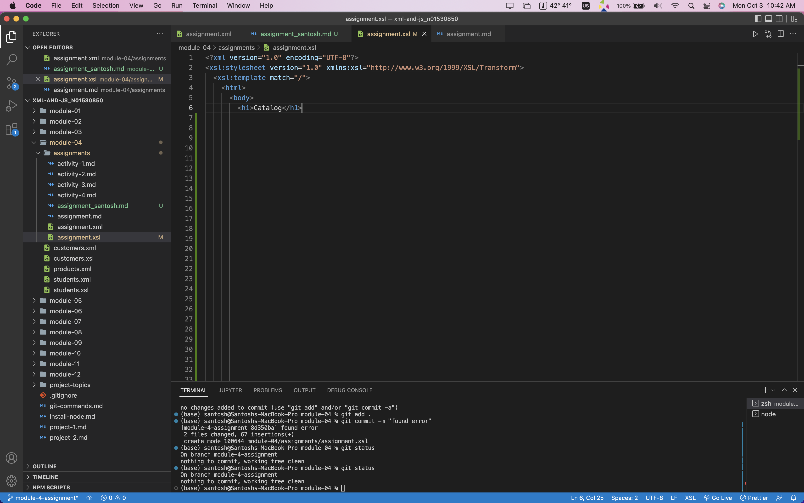
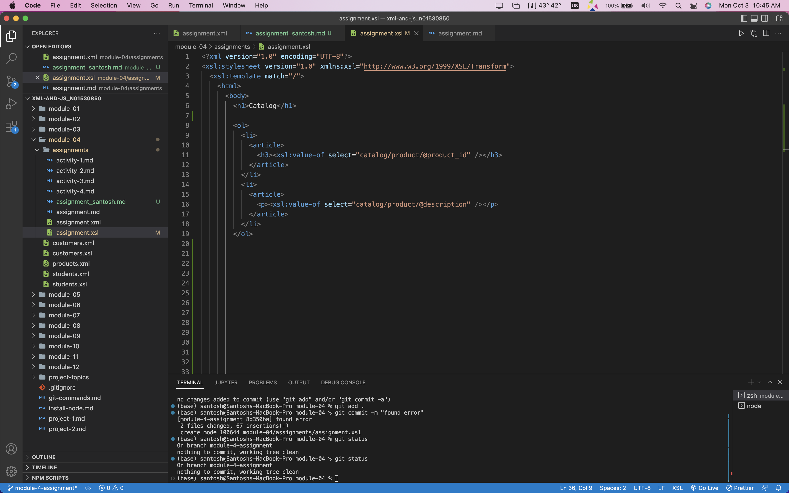
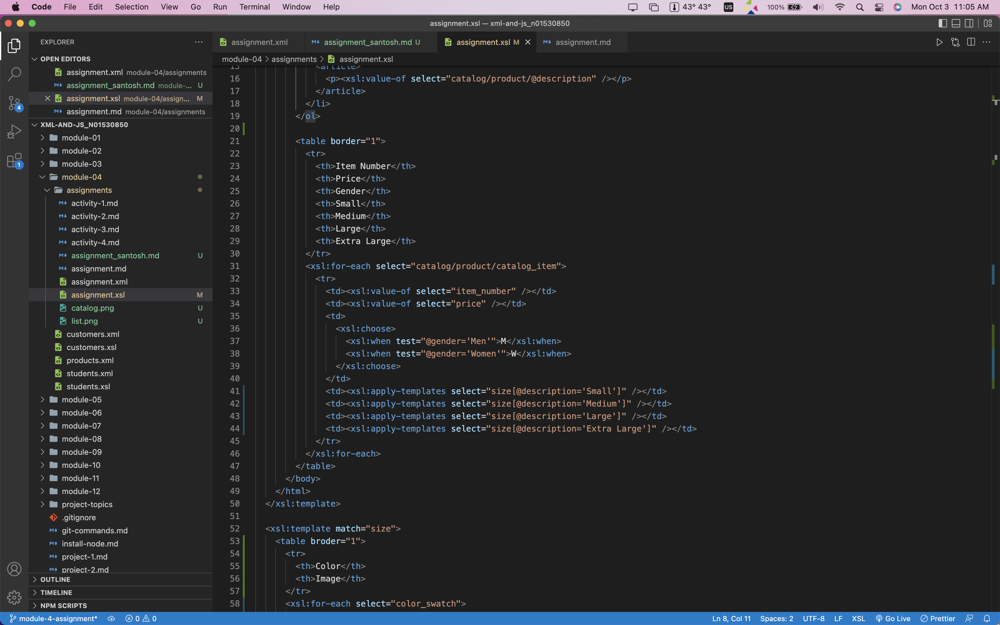
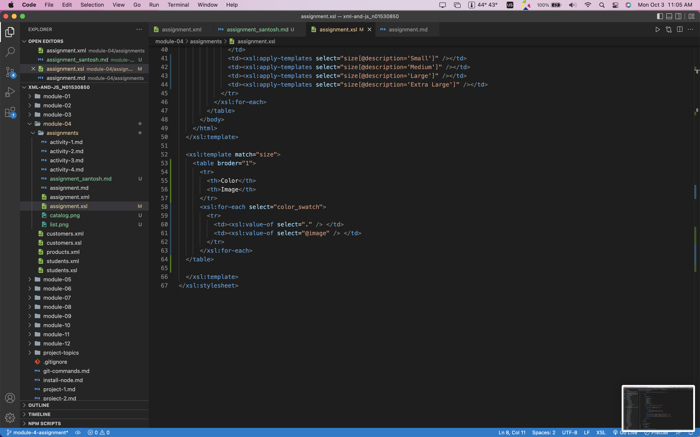
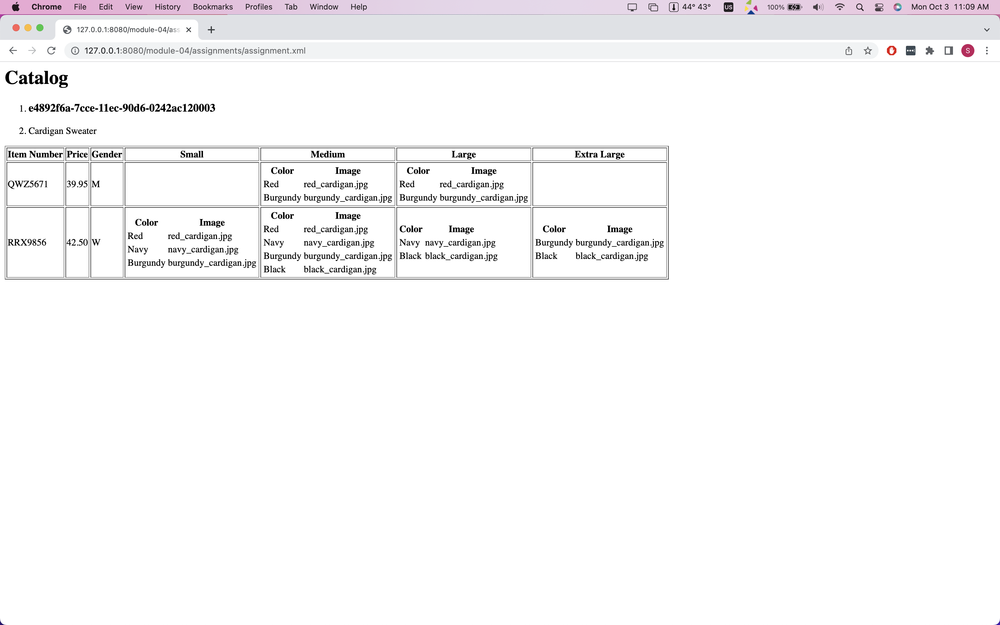

# Thought Process   

- main title is "Catalog"   

  - Added the xml version declaration and stylesheet namespace.
  - Added a template to match the root of the document
  - Inside the template added the main title "Catalog"

     

- use html list tag to display catalog   
- render each item as <article> inside list item tag    
- display product id as h3   
- display product description as paragraph      

  - Added a list tag to display catalog
  - <article> tag is used inside each list item tag
  - product id is displayed as h3 using xsl:value-of
  - description is displayed as paragraph using xsl:value-of

    

- render table of catalog items with columns: item number, price, gender, small, medium, large, extra large (if column item is not present in item, then display empty cell)    
  - Used for-each to loop through catalog_item and used value-of to read the required column value.
- for gender column render M for Men, W for Women   
  - Used a xsl:when to map the data
- inside size columns (small, medium, large, and extra large) display subtable with 2 columns: color and image   
  - Used a second template to match the size and display the sub table.

  
  

  -