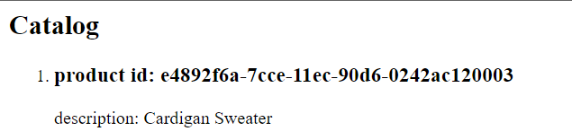
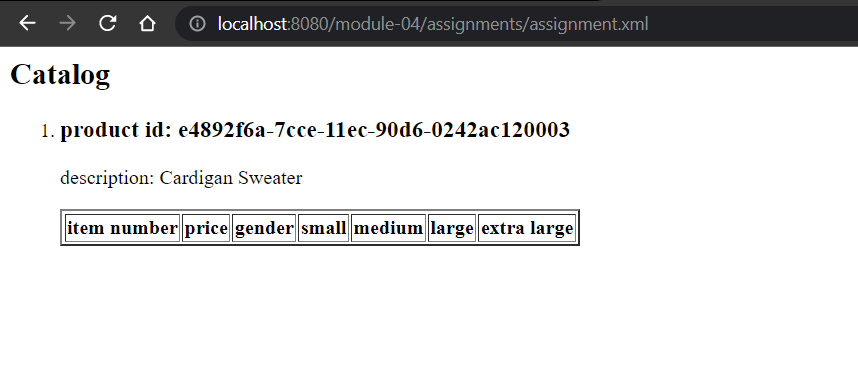
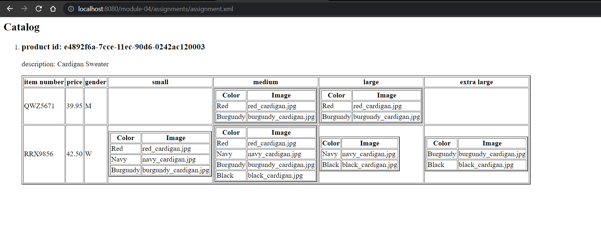

# Assignment

1. Open `module-4/assignments/assignment.xml` in your editor
2. Create xsl file and add link to it
3. Display catalog in the following way

- main title is "Catalog"
- use html list tag to display catalog
- render each item as `<article>` inside list item tag
- display product id as h3
- display product description as paragraph

- render table of catalog items with columns: item number, price, gender, small, medium, large, extra large (if column item is not present in item, then display empty cell)

- for gender column render M for Men, W for Women 
- inside size columns (small, medium, large, and extra large) display subtable with 2 columns: color and image

-----------------------------Explanation------------------------------- 
- Here, title is given in h2 tag
- ordered list is used 
- for each loop to render to the product (catalog/product) because root element.
- article tag is used and then h3 tag for product and for description p(paragraph) tag is used.
- table is created and column names is given and inside that table another subtable is created for the size.
- catalog item is renderd using for each loop and switch case that is choose is used for gender.
- for the size, first go through all the size using for each and then if the required size description is there then it selects color and image from color_swatch. Likewise go through each size. 

Create `module-4/assignments/assignment_YOURNAME.md` and explain your thought process in it. Add screenshots of each step to the file (Refer `week-1/assignments/evaluation-1.md` on how to add image to md file)
