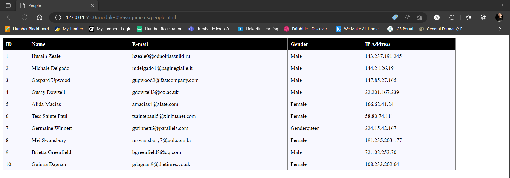

## Activity1 - module05
## Leon Czarlinski - n01541167

1. Convert `people.json` into xml file

2. Create html file, dynamically load data from `people.xml` into table, display full name for each person
 <!--full name displayed second column-->

