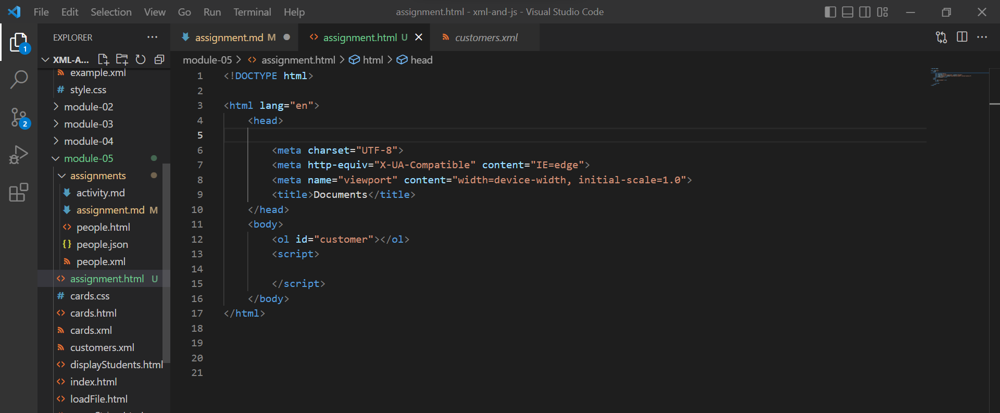
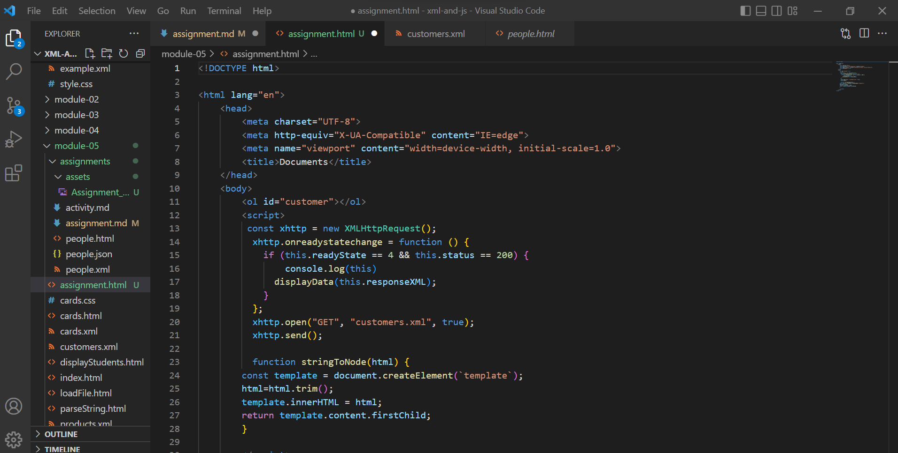
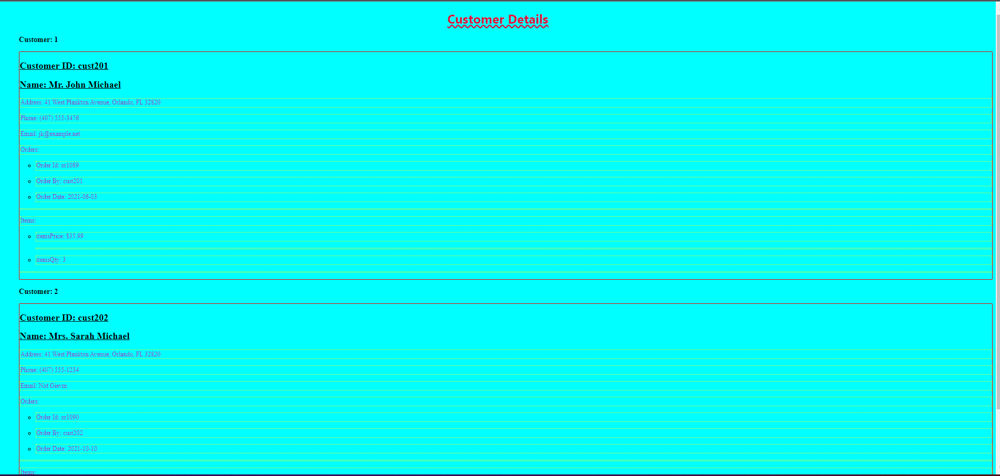
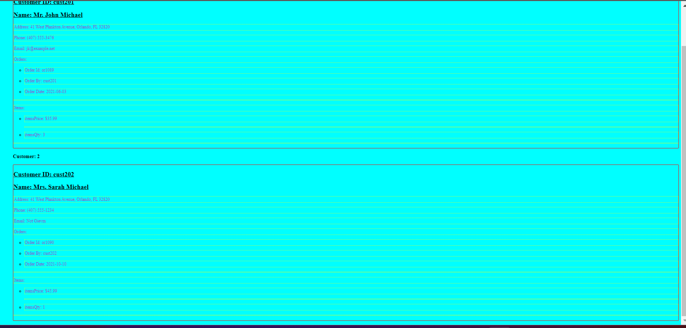

# Assignment

- Create empty html file
  
   HTML file create name "assignment.html". 

- Create empty script tag

   Empty tag created

   Image of Code:
   
  
- Read data from `customers.xml`

   Have read the customer.xml file
   attaching the image of code:
   

- Create function to render customers from loaded file into html in any format (it can be a table, or a list, or just plain divs)

Output pics

