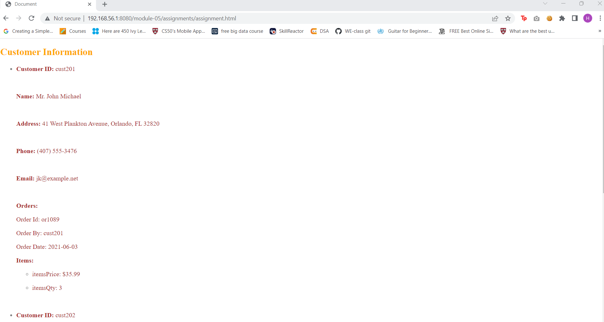

# Assignment

- Create empty html file :assignment.html
- Create empty script tag
- Read data from `customers.xml`
- Create function to render customers from loaded file into html in any format (it can be a table, or a list, or just plain divs)
