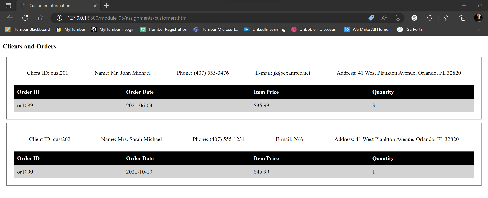

# Assignment - module05
## Leon Czarlinski - n01541167

1. Create empty html file
2. Create empty script tag
3. Read data from `customers.xml`
4. Create function to render customers from loaded file into html in any format (it can be a table, or a list, or just plain divs)

HTML with structure and function

CSS with the style info

Image with the output

