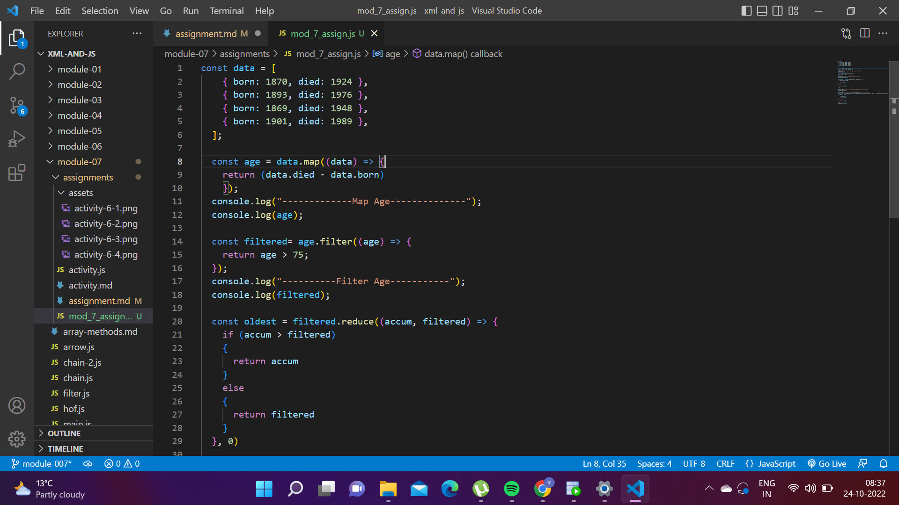
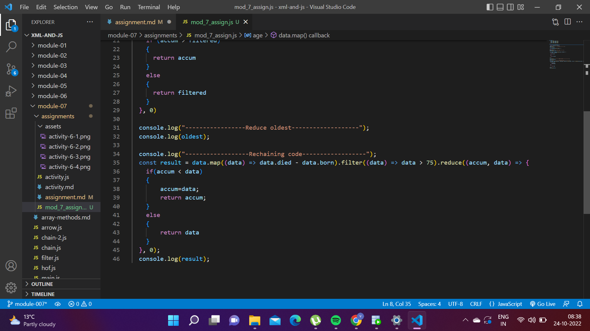
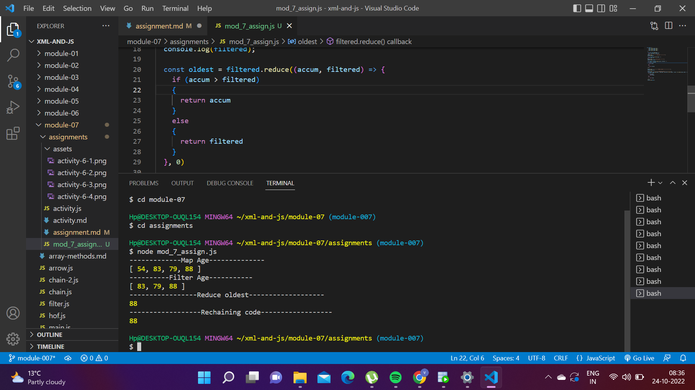

# Assignment

- Save following data into `data` variable

```js
[
  { born: 1870, died: 1924 },
  { born: 1893, died: 1976 },
  { born: 1869, died: 1948 },
  { born: 1901, died: 1989 },
];
```

- Map `data` and calculate age for each entry (died - born) and save into new variable `age`
done - map age
- Filter `age` to be greater than 75 and save into `filtered` variable
done - filter age
- Reduce `filtered` to output the highest age and save into `oldest` variable
done - reduce oldest
- Refactor your code to use chaining
done - rechaning code
- console.log the result
done
- Attach screenshot of the output in your terminal



