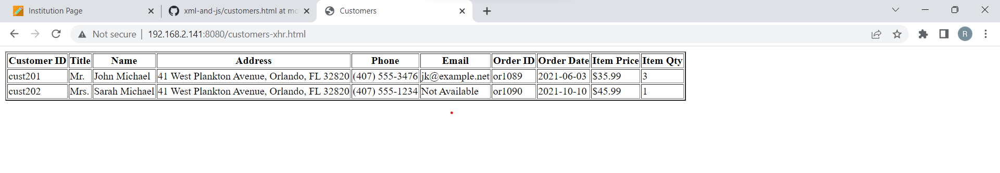

# Assignment
- Take your module 5 assignment
- Create 3 different verion of it
  - Using promisified XHR
  - Using fetch API with .then()
  - Using fetch API with async/await
- Attach screenshots of the output in your terminal

# xhr -

# fetch -

# async -

