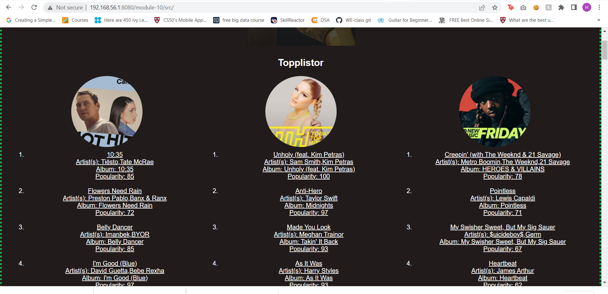

# Assignment

- Expend your activity to also show tracks for playlists
- Each playlist object has a field `tracks` that has the endpoint to load tracks. display at least track name and artist
- Attach screenshots of your page

Answer in folder src.
 Output:
 