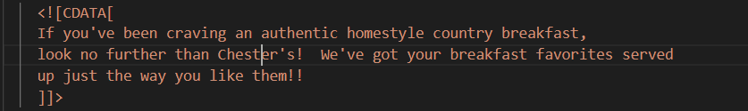
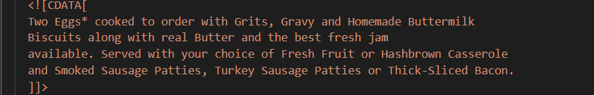
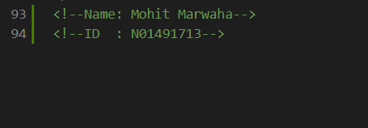
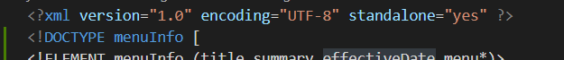
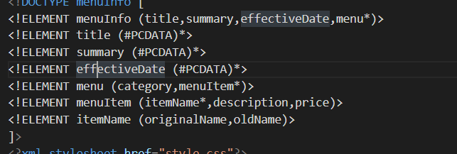
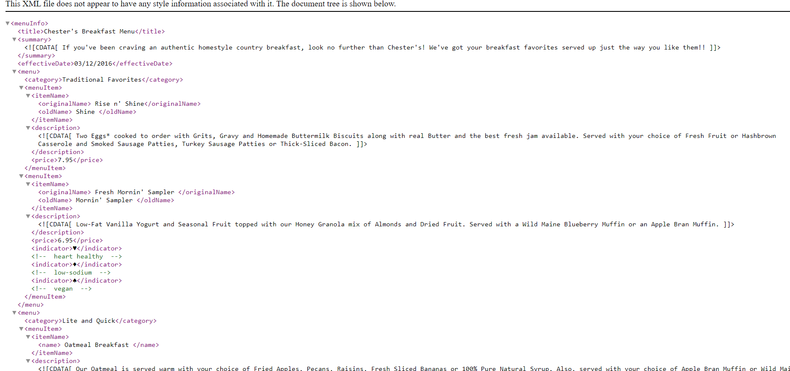
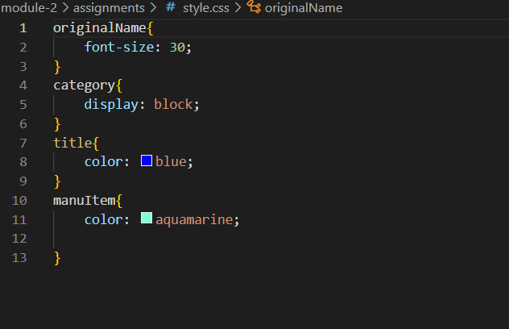

# Assignment1
# Name-Mohit Marwaha
# Humber Id- N01491713

 - [x] Q-1:
1. effecttiveDate instead of effective Date

2. originalName instead of originalname

3. originalName istead of name

- [x] Q-2:
1. 

- [x] Q-3:

- [x] Q-4:
1. prolog :
- 
- 
2. document body :
- every tag in this documents inside of root tags are the part of document body.
3. epilog :

4. processing instructions :
- css link

- [x] Q-5:
1. inline DTD : 

- [x] Q-6: 

- [x] Q-7: 
