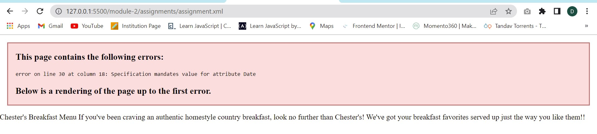
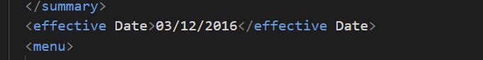
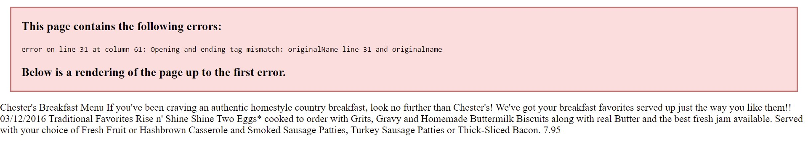
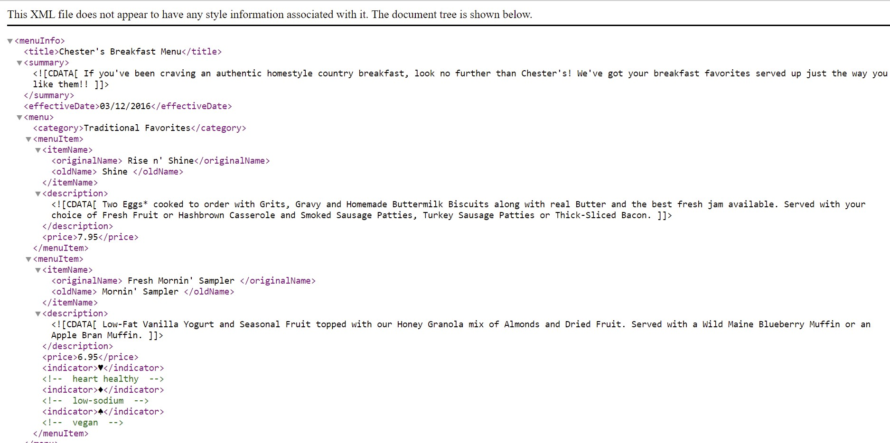
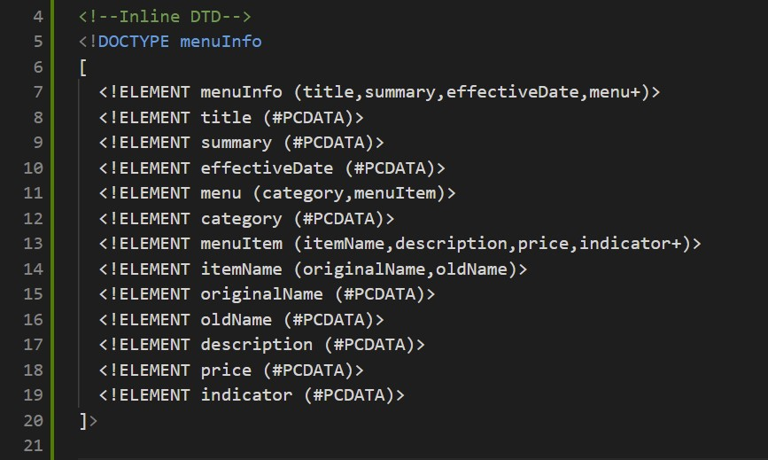
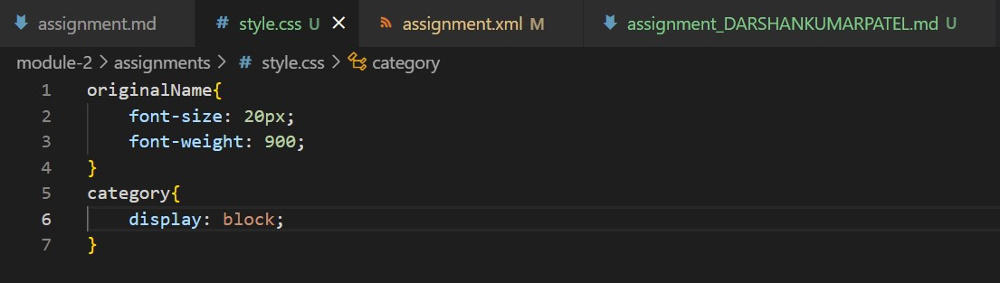

1. As i have identified the error was in tag.Actually XML element names cannot contain spaces.However,I have solve  it just by removing space between the tag(i.e., line 11 <effective Date> changed to <effectiveDate>).

    After Sloving it another error arises is on line 31,capital and small letter error in opening and closing.
    so it was  <originalName> Fresh Mornin' Sampler </originalname> changed to <originalName> Fresh Mornin' Sampler </originalName> and on line 51 <name> Oatmeal Breakfast </originalName> changed to <originalName> Oatmeal Breakfast </originalName>.

    Now.All Errors were sloved and finally file was displayed.There are still some missing tags that i will figure out.

2.  In this document, CDATA(Character Data) is used so that parser does not parse in the document and it will not be treated as markup and entities will not be expanded.

3. 
    

4.  Prolog - (?xml version="1.0" encoding="UTF-8" standalone="yes" ?)
    Document Body - In XML file,all tags are called document body.
    Epilog - (?xml-stylesheet type="text/css" href="style.css"?)

5. 
    

6-7. 
    
