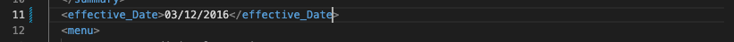
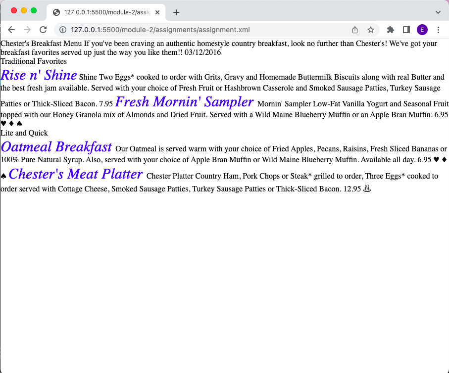

The first error is at line 11 column 18. there cannot be blank spaces in the element. another way we can look at it is that the date describes the element effective therefore a value has to be assigned to date. so we have two ways to fix the errors either assign a value to date or use an underscore to connect effective to date.  
the next error is at line 31 Opening and ending tag mismatch: originalName line 31 and originalname     
the third error is at line 51 opening and ending tag mismatch 
The CDATA in the document is used so that the XML parser interprets it only as a character data and not as a markup 
line 1 in the document contains the prolog.the document body begins in line 2 where you have the <menuInfo> and ends on line 99. there are no processing instructions in the document but when i include the css style sheet, that would serve as the processing instruction which can also serve as an epilog. line 100-101 which was just added to the document is also an epilog. 
there were no erros found  
the final image after adding the css 