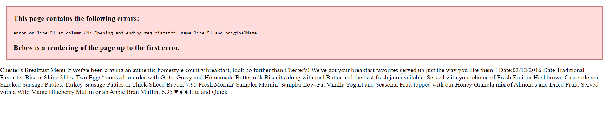
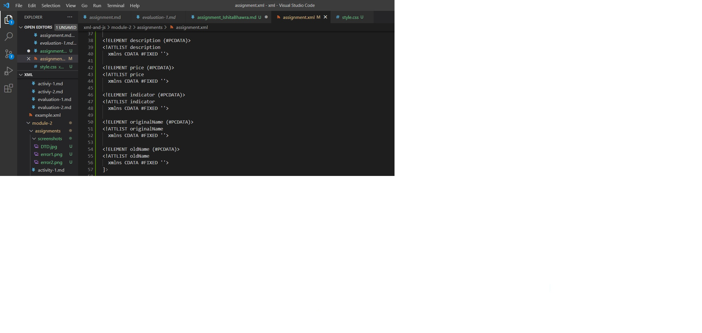
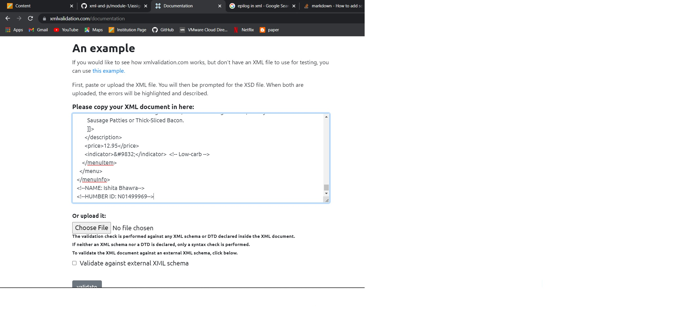
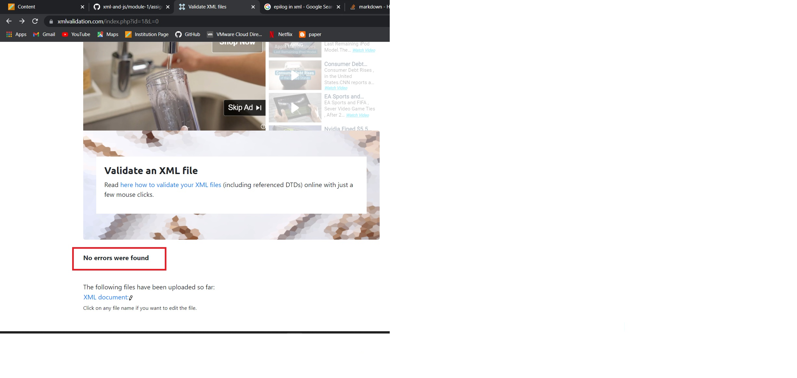
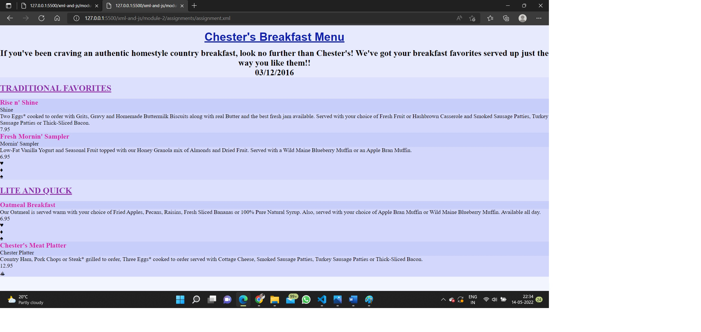

# Assignment 1

1. This page contains the following errors:
   * error on line 11 at column 18: Specification mandates value for attribute Date
   <effectiveDate>03/12/2016</effectiveDate>

   * error on line 31 at column 61: Opening and ending tag mismatch: originalName line 31 and originalname
    
    solution: </originalName>

   * error on line 51 at column 49: Opening and ending tag mismatch: name line 51 and originalName
    
    solution: <originalName>

2. CDATA stands for character data and CDATA block is used in this document to add content that is marked up as textual data as the description and summary of the following menu items.

3. <!--NAME: Ishita Bhawra-->
   <!--HUMBER ID: N01499969-->

4. 
    * prolog(xml declaration, document declaration, processing instructions, comments, white spaces all of these are included in prolog)In this document we have :
   
    xml declaration as prolog : <?xml version="1.0" encoding="UTF-8" standalone="yes" ?>

    comments :  <!-- heart healthy -->
                <!-- low-sodium -->
                <!-- vegan -->  
                <!-- Low-carb -->

    * document body:
    whole content of xml document is the document body
   
    * epilog: final or the comments and process instructuions which are added in the xml file in the end.
              <!--NAME: Ishita Bhawra-->
              <!--HUMBER ID: N01499969-->
      processing instructions:
      <?xml-stylesheet type="text/css" href="style.css"?>

    * currently there are no processing instructions as such in the given document but after creating the css style sheet we are going to link that style.css it to the assignment.xml as its processing instruction.
    <?xml-stylesheet type="text/css" href="style.css"?>

5. Inline DTD for this document:
    
    

6. This file was verified using the link provided in the learning material (slides)
    
    

7. The style.css was made with required tags and linked to assignment.xml file.
    

