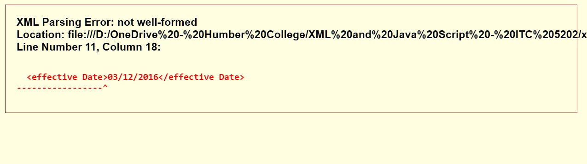
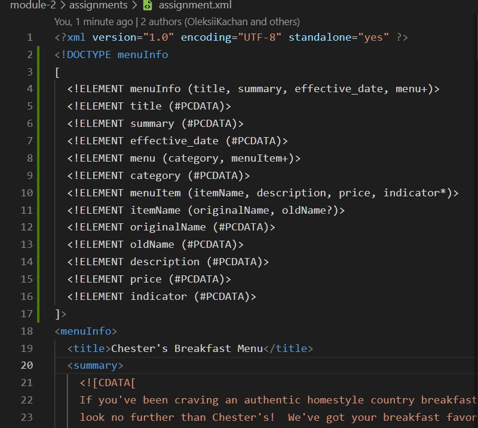

# Assignment 1

1. 

Error 1

It is a "not well-formed" error which the problem lies in the xml code itself on Line 11. We can fix it by removing the space and replace with underscore (_).

Error 2

The second error is mismatched tag. The capitalization on originalName tag don't match. We can fix it by matching the tag name.

Error 3

The third error is also a mismatched tag. The tag names don't match. We can fix it by matching the tag name.

2. 

CDATA in the document is used to add text description to the items o the menu. And also the text summary of the menu. It is marked as CDATA so it will be interpreted as characters and not as markup.

3. 

4. 

There are no processing instruction. In the screenshot there are only xml declaration and document type declaration.

5. 

Added DTD directly to the xml file.

6. 

I validated the xml file with DTD. 

And the test passed.

7. 

First, add the css file link to xml.

Then, I changed the font size of originalName to large with font-size. Changed the display for category to block so it's content will be on a new line. And also, I added some coloring to the categories, display menuItem and description on new lines, and changed the font-weight of originalName so it stands out a little bit more.

