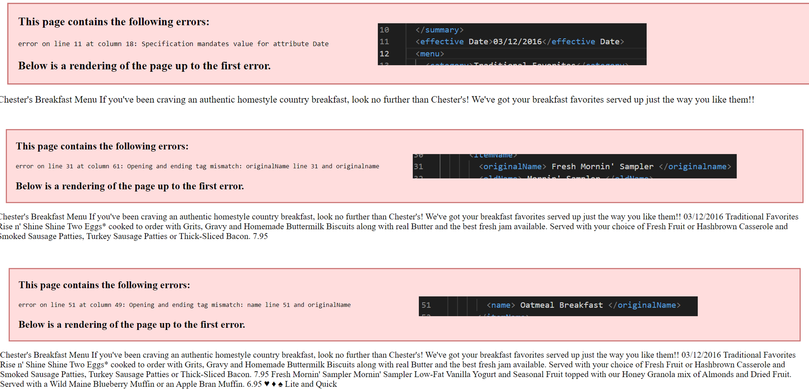
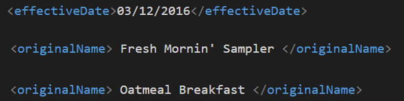
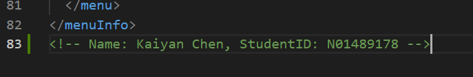
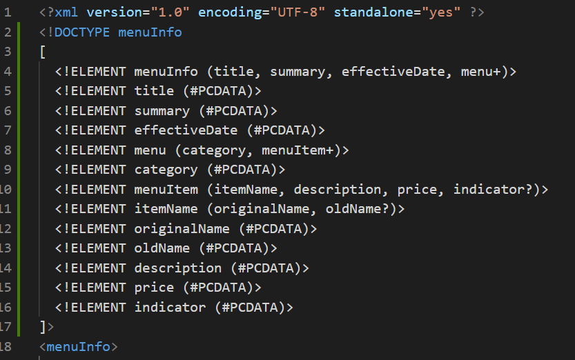
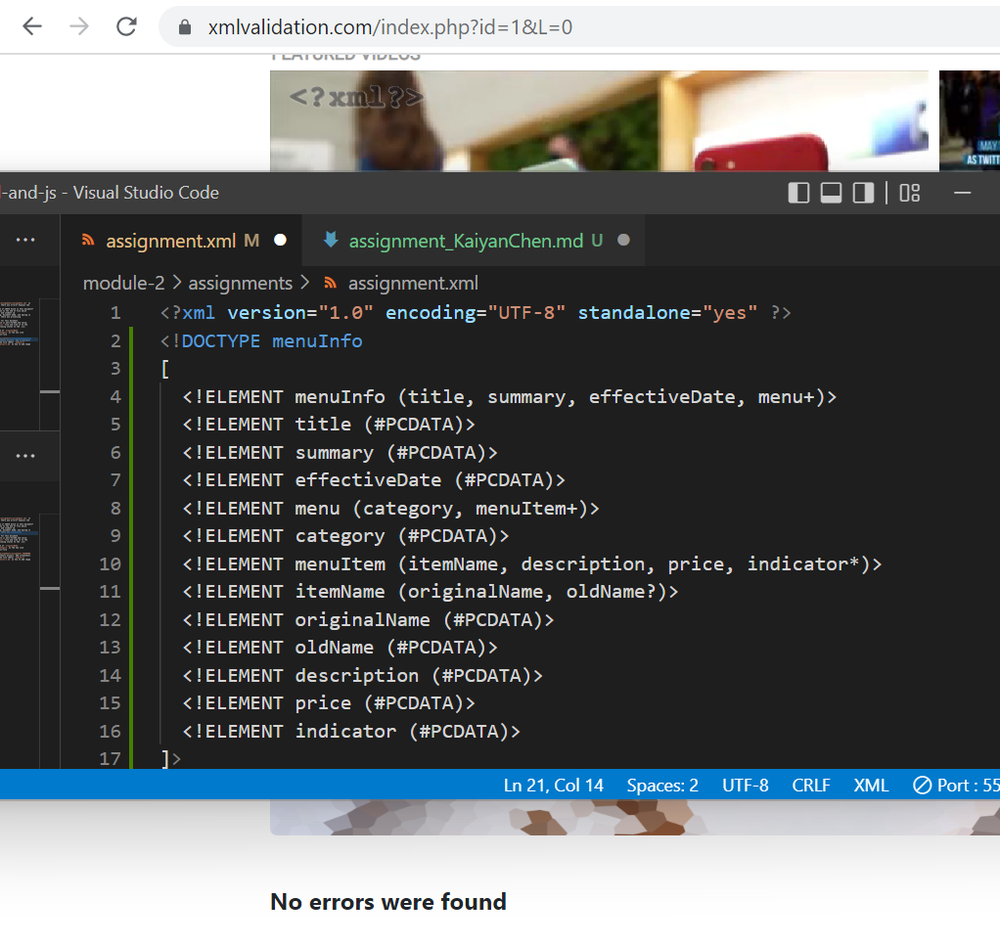
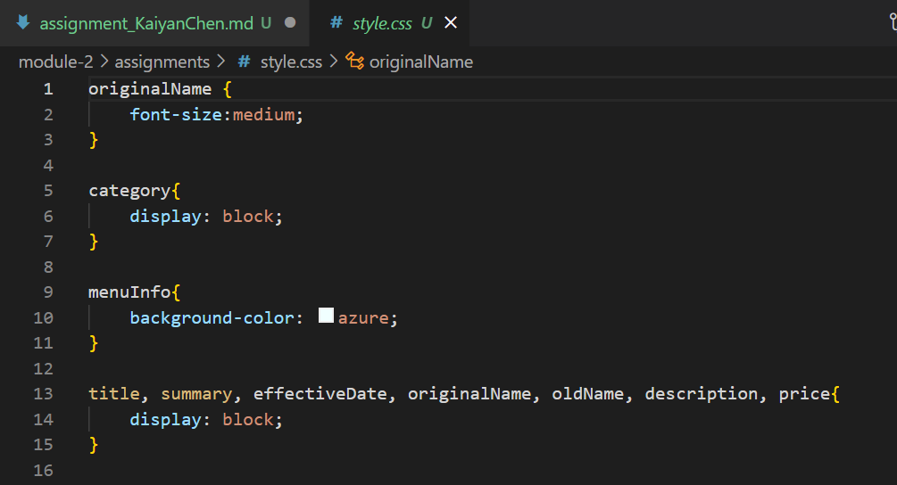

# Kaiyan Chen

1. There are several errors:
    - `<effective Date>`, there is space in the element names, which is not allowed
    - `<originalName> </originalname>`;
      `<Name> </originalName>`
    opening and ending tag mismatch, XML is case sensitive
    
    
2. To make XML treats them as character data only
3. Done
    
4. Prolog: prior root element `<menuInfo>`; 
   Document body: start from root element `<menuInfo>`;
   Epilog: comment after root element `<menuInfo>`;
   There is no processing instruction; Q7 created one as
   `<?xml-stylesheet type="text/css" href="style.css"?>`
5. Done
    
6. The file is valid
    
7. Done
    