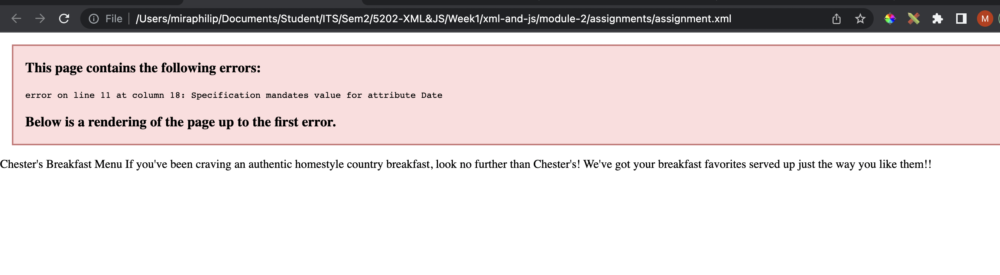
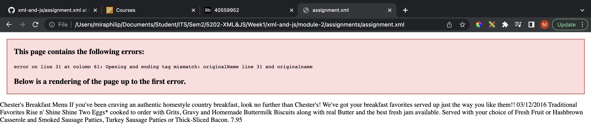
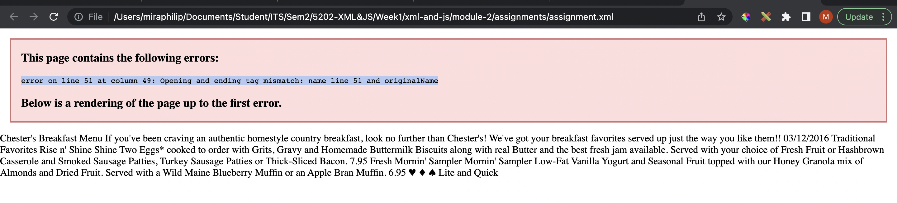
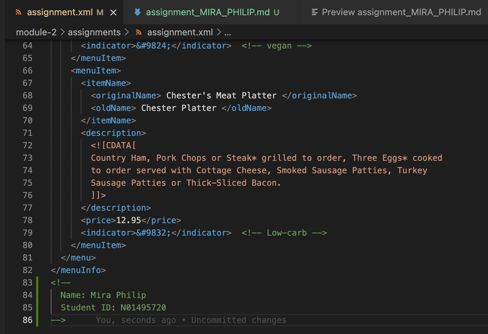
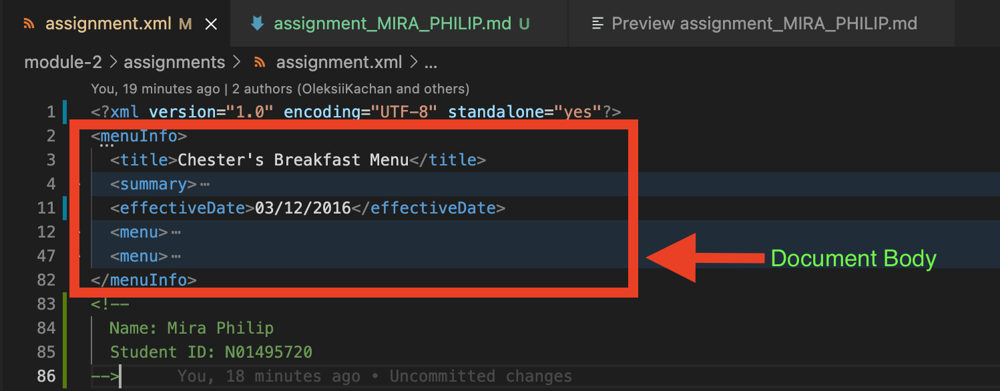
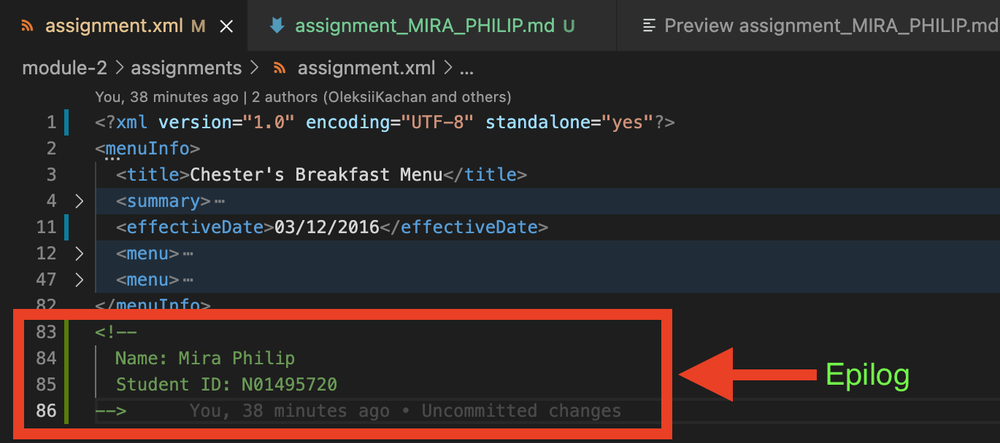
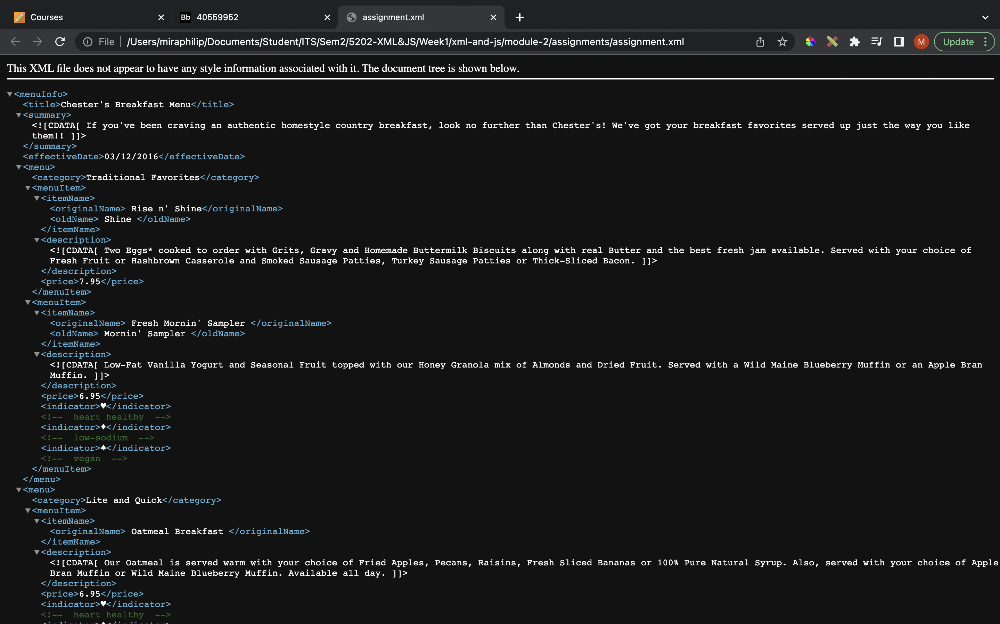
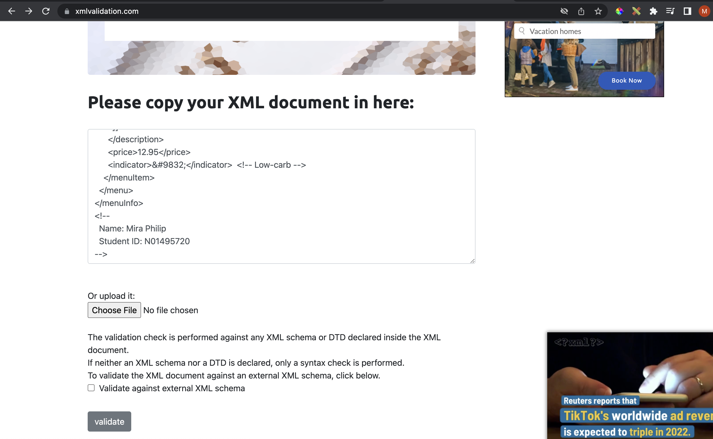
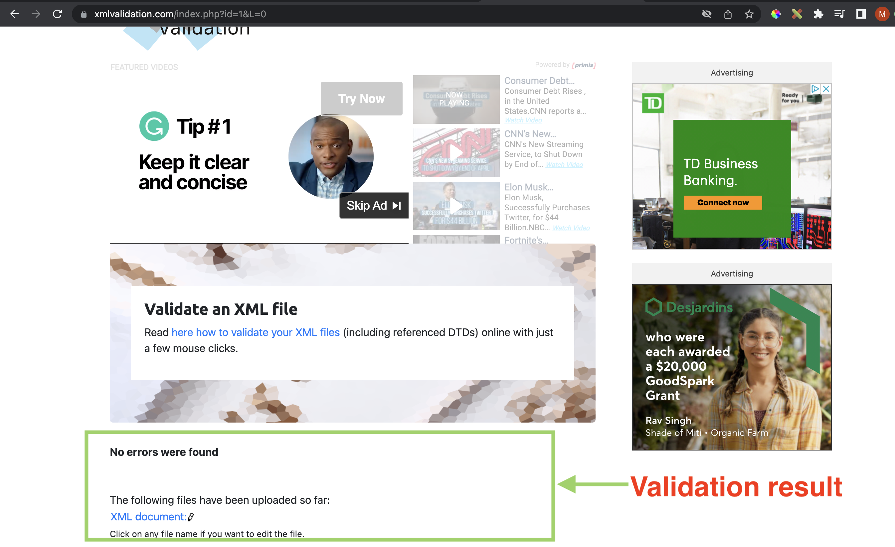
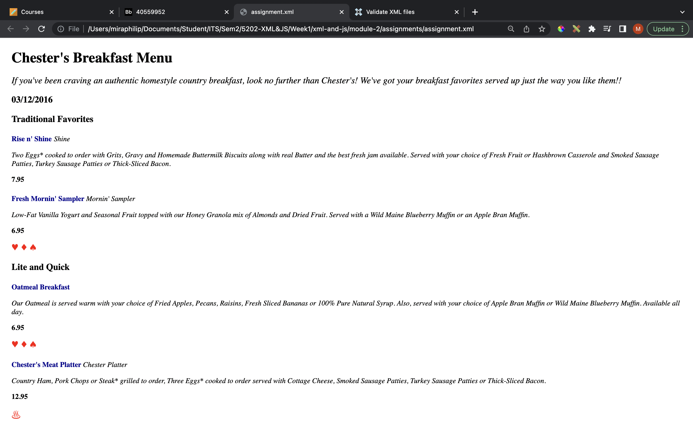

# Assignment 1 - Answers

1. Open `module-2/assignments/assignment.xml` in your browser. Are there any errors? Explain the error and fix it.

    There are errors in `module-2/assignments/assignment.xml` as shown below

    ## Error 1:

    __Error image:__ 
    __Error message:__ `error on line 11 at column 18: Specification mandates value for attribute Date`  
    __Error explanation:__ This indicates that Date (which looks like an attribute) does not have any value.  
    __Error code:__ `<effective Date>03/12/2016</effective Date>`  
    __Error fix:__ The issue seems to be with the element name separated with space, effectiveDate as an element name makes more sense than adding a Date attribute to `<effective>` element.Therefore, changing it to `<effectiveDate>03/12/2016</effectiveDate>`  

    ## Error 2:

    __Error image:__ 
    __Error message:__ `error on line 31 at column 61: Opening and ending tag mismatch: originalName line 31 and originalname`  
    __Error explanation:__ Element's opening/closing tagnames must be an exact match (case sensitive) and here the element originalName's closing tag is not matching opening tag.  
    __Error code:__ `<originalName> Fresh Mornin' Sampler </originalname>`  
    __Error fix:__ Changed it to `<originalName> Fresh Mornin' Sampler </originalName> `  

    ## Error 3:

    __Error image:__ 
    __Error message:__ `error on line 51 at column 49: Opening and ending tag mismatch: name line 51 and originalName`  
    __Error explanation:__ Element's opening/closing tagnames must be an exact match. Here the element's opening tag is `name` instead of `originalName`.  
    __Error code:__ `<name> Oatmeal Breakfast </originalName>`  
    __Error fix:__ Changed it to `<originalName> Oatmeal Breakfast </originalName>`  


2. What is the use of CDATA block in this document?

    The CDATA in this document gives the detailed description of each menu item in the menu. The description text includes many special/markup characters and therefore CDATA is apt as it does not parse the content inside.

3. Add comment line to the end of file which contains you name and student id.

    DONE 

4. Identify prolog, document body, and epilog in the document. Are there any processing instructions?

    ## Prolog

    The prolog part in this document only contains XML Declaration

    ```bash 
    <?xml version="1.0" encoding="UTF-8" standalone="yes"?>
    ```

    ## Document body

    It starts from the root element `<menuInfo>` and ends at `</menuInfo>` and contains the whole tree structure

    

    ## Epilog

    The student id and name added as comment is a epilog. Epilog includes final comments or processing instructions

    

    ## Processing instructions

    There are no processing instructions

5. Add inline DTD for this document. - `DONE`

    ```bash
    <!DOCTYPE menuInfo 
    [
        <!ELEMENT menuInfo (title,summary,effectiveDate,menu+)>
        <!ELEMENT title (#PCDATA)>
        <!ELEMENT summary (#PCDATA)>
        <!ELEMENT effectiveDate (#PCDATA)>
        <!ELEMENT menu (category,menuItem+)>
        <!ELEMENT category (#PCDATA)>
        <!ELEMENT menuItem (itemName,description,price,indicator*)>
        <!ELEMENT itemName (originalName,oldName?)>
        <!ELEMENT originalName (#PCDATA)>
        <!ELEMENT oldName (#PCDATA)>
        <!ELEMENT description (#PCDATA)>
        <!ELEMENT price (#PCDATA)>
        <!ELEMENT indicator (#PCDATA)>
    ]>
    ```

6. Verify that file is well-formed and valid.

    ## Well-formed : `YES as it does not have any syntax errors`
    

    ## Valid: `YES`
    Using https://www.xmlvalidation.com/, copy paste the XML content 
    

    `After validation`
    

7. Create `style.css` file and link it to the file. Add the following styles to the .css:

- Change font-size of `originalName` - `DONE`

    ```bash
    originalName {
        font-size: 25px;
    }
    ```
- Display each `category` on the new line - `DONE`

    ```bash
    category{
        display: block;
    }
    ```

- Add any other css-rule - `DONE`

    ```bash

    originalName {
        font-size: 20px;
        color: darkblue;
        font-weight: bold;
    }
    category,
    summary,
    effectiveDate,
    description,
    menuItem,
    price {
        display: block;
        margin: 1em 0 1em 0;
        font-size: 25px;
    }
    effectiveDate {
        font-weight: bold;
    }
    summary,
    oldName,
    description {
        font-style: italic;
    }
    menuInfo {
        margin: 2em;
    }
    title {
        font-size: 40px;
        font-weight: bold;
    }
    category {
        color: darkblue;
        font-weight: bold;
    }
    oldName {
        font-size: 20px;
    }
    description {
        font-size: 20px;
    }
    price {
        font-size: 20px;
        font-weight: bold;
    }
    indicator {
        color: red;
    }

    ```
    ## styled XML
    


Create `module-2/assignments/assignment_YOURNAME.md` and add your theory answers. Add screenshots of each step to the file (Refer `module-1/assignments/evaluation-1.md` on how to add image to md file)
