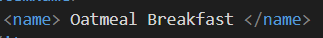
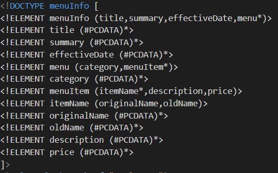

# Assignment 1
# Name : Viraj Chandubhai Paneliya
# ID : N01512139

- [x] Q-1:
1. Line 11 white space is not allowed in element name 
2. Line 31 element name is case sensitive so orinalname and originalName are considered as different 
3. Line 51 opening and closing tag should have same name 

- [x] Q-2:
1. CDATA block is used for writing some special characters like &, >, <, !, etc. which characters need escaping from parsing
in this document there is '!' which need escaping from parsing so we used CDATA block for that.  

- [x] Q-3:
comments are written in <!-- comment--> tag like html 

- [x] Q-4:
1. prolog :
- xml declaration : 
- Comments : 
2. document body :
- from starting of root element <menuInfo> to ending of that element </menuInfo> is considered as body. each elements specified in this part are the part of document body.
3. epilog :
- css link : 
4. processing instructions :
- css link and DTD is considered as processing instructions

- [x] Q-5:
1. inline DTD : 

- [x] Q-6: 

- [x] Q-7: 
1. Change font-size of originalName
2. Display each category on the new line
3. Add any other css-rule