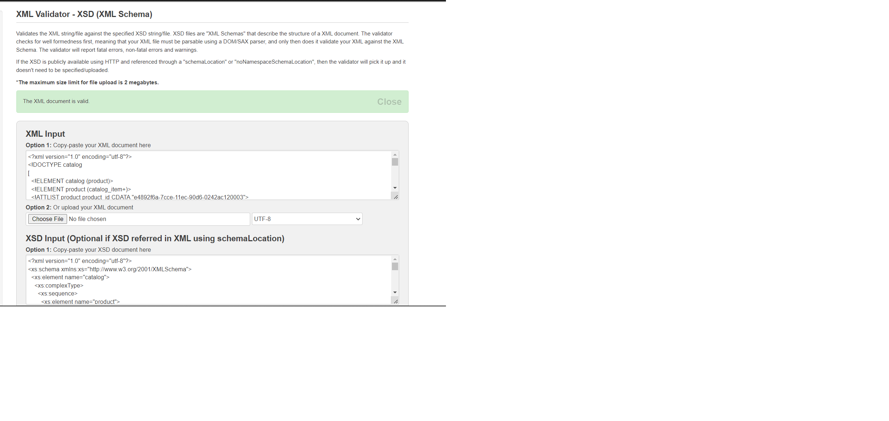

# Assignment

1. Open `module-3/assignments/assignment.xml` in your editor
2. Create DTD for this file and validate it using any of the tools we used
3. Create XSD for this file and validate it using any of the tools we used
4. Explain your thought process for these 2 declarations

    While making dtd i was stuck in adding the elements of the catalog like i added all the tags at first but got to know that which one are the elements of catlog and eventually was able to understand how to add them properly. DTD was quite easy and simple for this short xml file and it can be easily done if one knows the proper syntax and how to add attributes and elements. But for a complex xml file it may not be that easy.
    On the other hand while making xsd file i did that in class and understood how to write it and tried to implement it as it was told in class lecture. Had problems while declaring tags because each and every tag needs to be closed. Moreover, in xsd file we need to declare complex type , simple content, attribute, element, extension so need to take all of that in account and make it properly otherwise it will give errors while validating it. 

Create `module-3/assignments/assignment_YOURNAME.md` and add your theory answers. Add screenshots of each step to the file.

