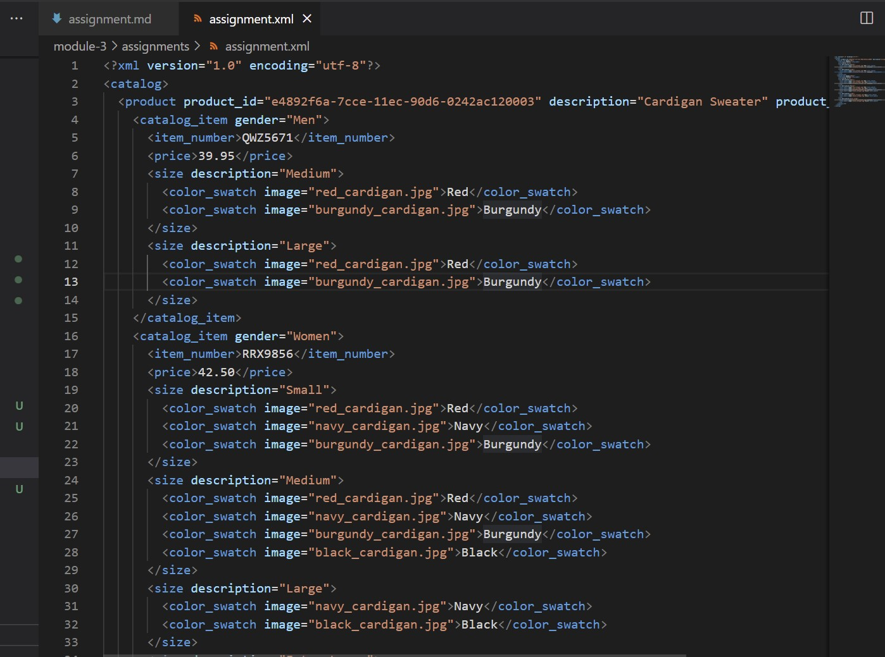
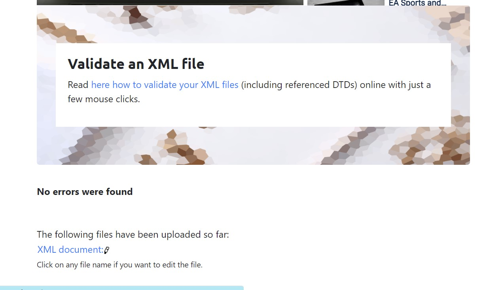
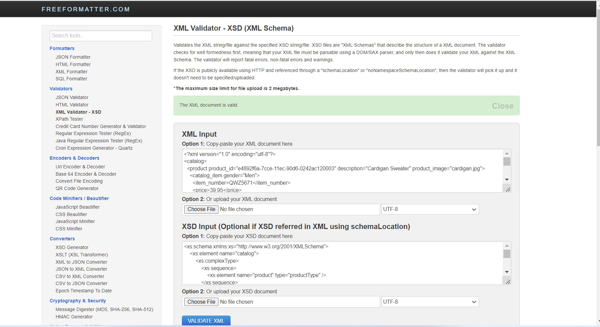

1.   

2.  
    

                                     or

    
    

3.  

4.  DTD(Document Type Definition) is used to give structure of document and not set of rules.The   main thing is it give a way to check validity of XML elements like they appear in right order,mandatory attributes are in place and so on.The disadvantage is it only support text string datatype and it does not support namespace and it is also complex while on other side XSD(XML Schema Definition) is easy to learn and is also extensible.As compared to DTD,XSD has more control on XML file.It also support default value and namespace which is not supported bt DTD.Hence,according to analysis,XSD is most preferred to use than DTD.  
