# Module 3 Assignment

## DTD

My thought process: 

1. catalog

First element is catalog with one or many products.

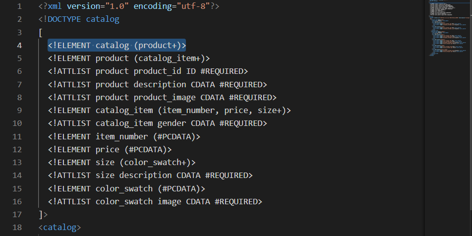

2. product

Each product includes one or many catelog_items. Based on the given xml file, there are three attributes, one of them is ID type. All three attributes are set to be required.

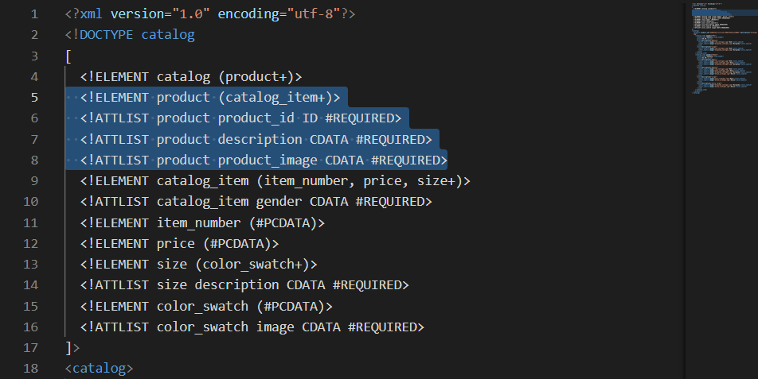

3. catalog_item

Each catelog_item includes item_number, price, and one or many sizes. Catelog item has an attribute gender, which is text(character data) and set to be required.

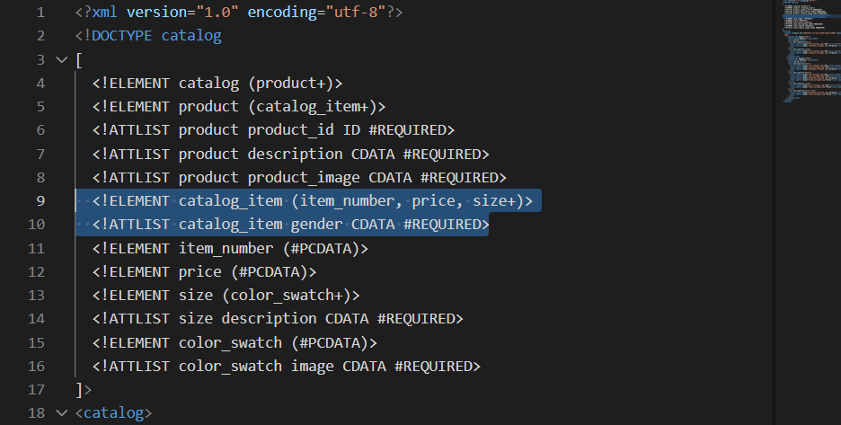

4. item and price

Item and price contain parsable data.

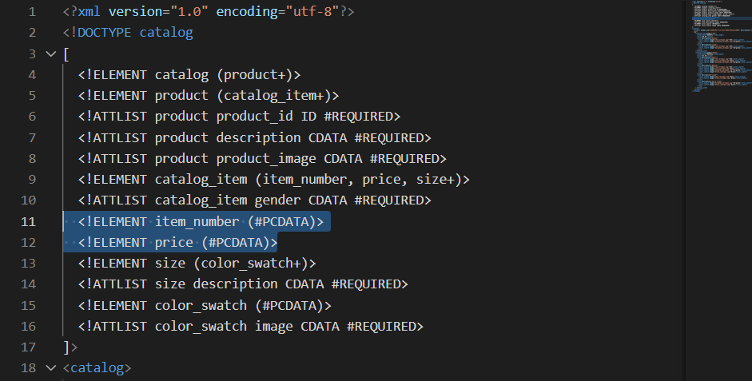

5. size

Element size contains at least one color_swatch. Each has an attribute description as required and text type.

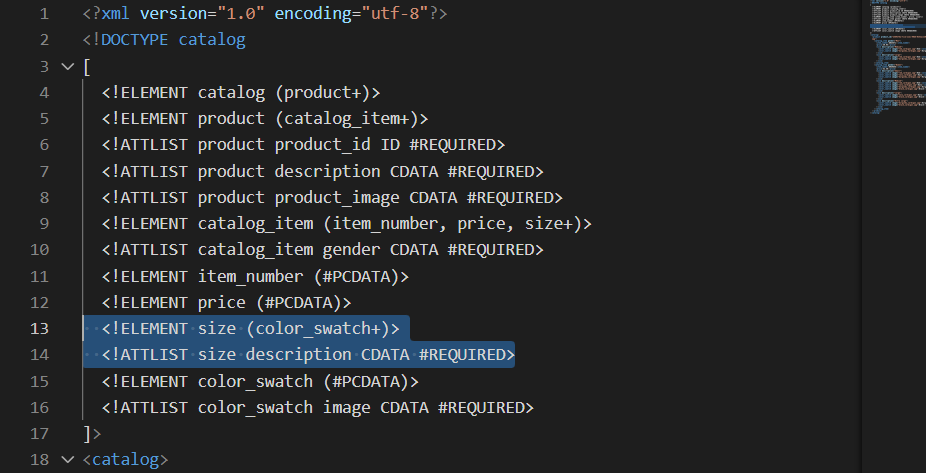

6. color_swatch

Color_swatch contains parsable data, and it has an attribute called image. The attribute image is character data type and is required. 

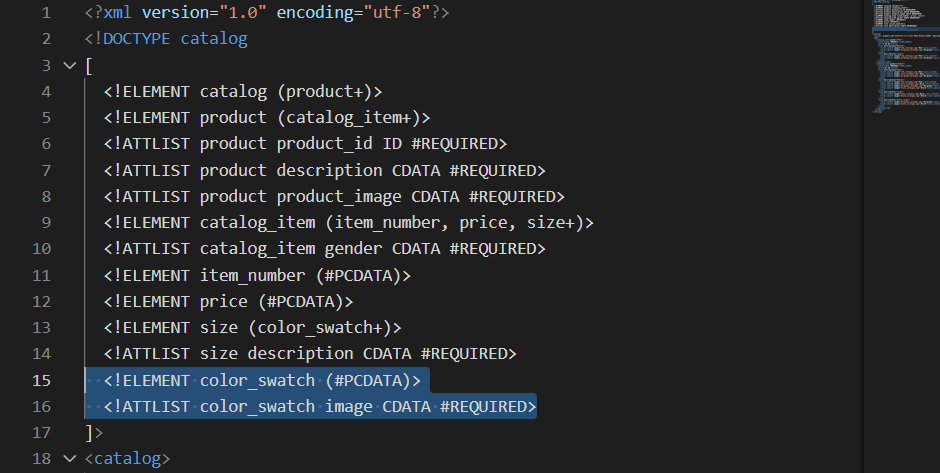

7. Validating the DTD schema.

Validation Result

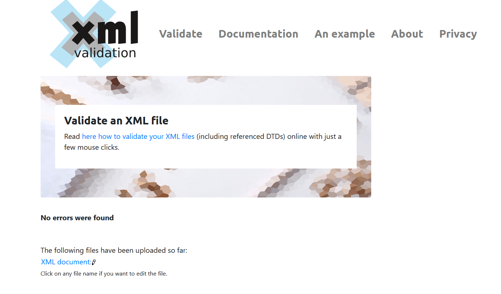

## XSD

1. catalog and catalogType

The xml starts with catalog, so create an element for it. Because it has children, the type is set to define its own type. ie. catalogType.

Inside catalogType there is a product child with its own children, so the type is set to its own type. ie. productType.

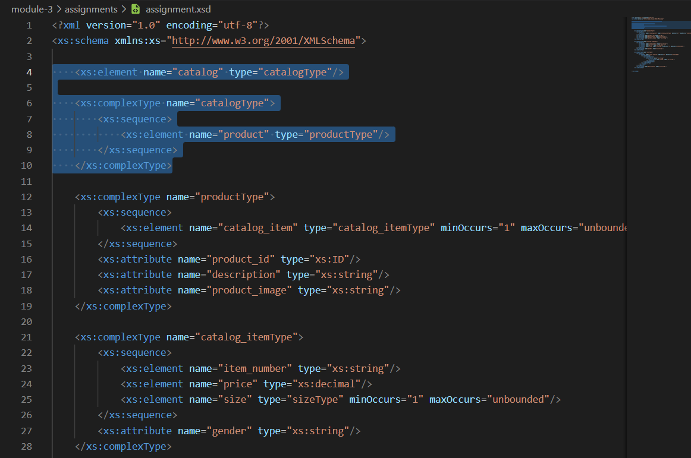

2. productType

Then again inside product there is a sub-item catalog_item which has its own children, so the type is assigned to be its own type ie. catalog_itemType. Plus, since there are multiple catalog_item under product tag, the Occurances are set to 1 or more. ie. minOccurs="1" maxOccurs="unbounded".

Then to add product tag's attributes. ie. product_id, description, product_image. And set their data types respectively.

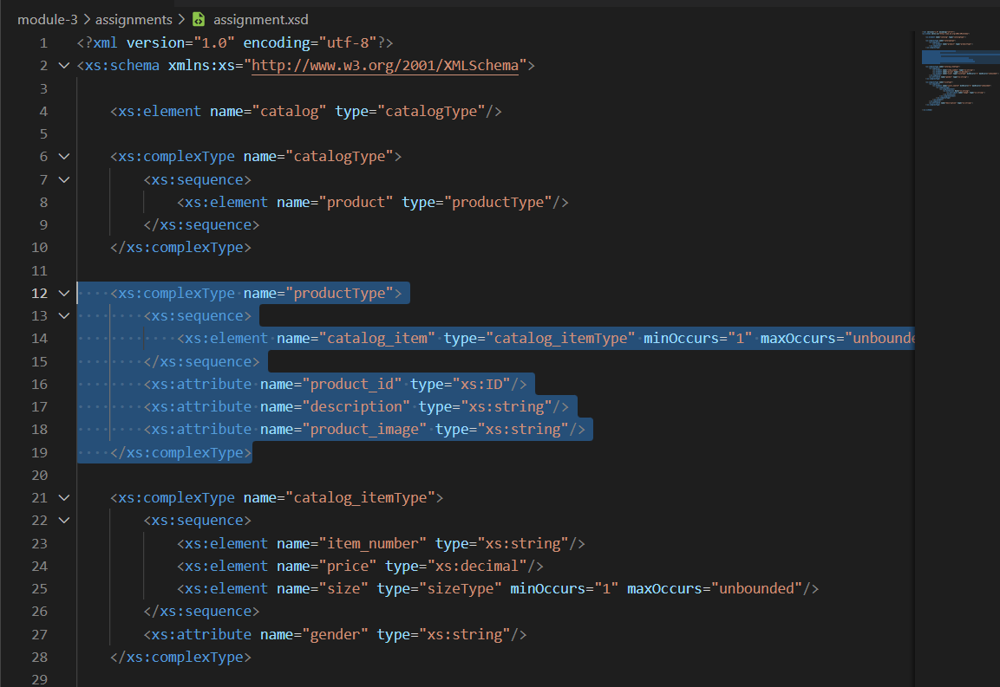

3. catalog_itemType

Inside catalog_item tag thre are three type of tags. ie. item_number, pricem and size. item_number and price only occur once and  don't have children, therefore the type is set to their repective data types. 

Size tag has children, so its type is set to be its own type. ie. sizeType. And since it occurs more than once, here I set it to occur at least one. ie. minOccurs="1" maxOccurs="unbounded". 

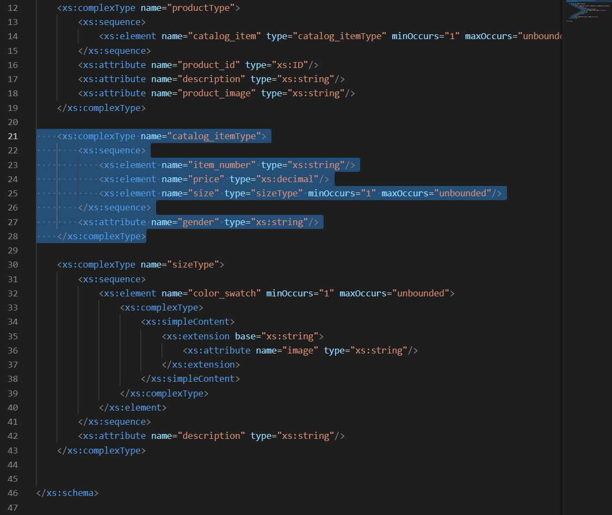

4. sizeType

Size has an element called color_swatch. So first set the element, then add it's occurance frequency. ie. minOccurs="1" maxOccurs="unbounded". 

Each color_swatch is a simple type, so to add the attribute, ie. image, we need to add a complexType first, and then add simpleContent with extension based on xs:string type (color_swatch's data type). Because otherwise we can't add attributes to a simple type.

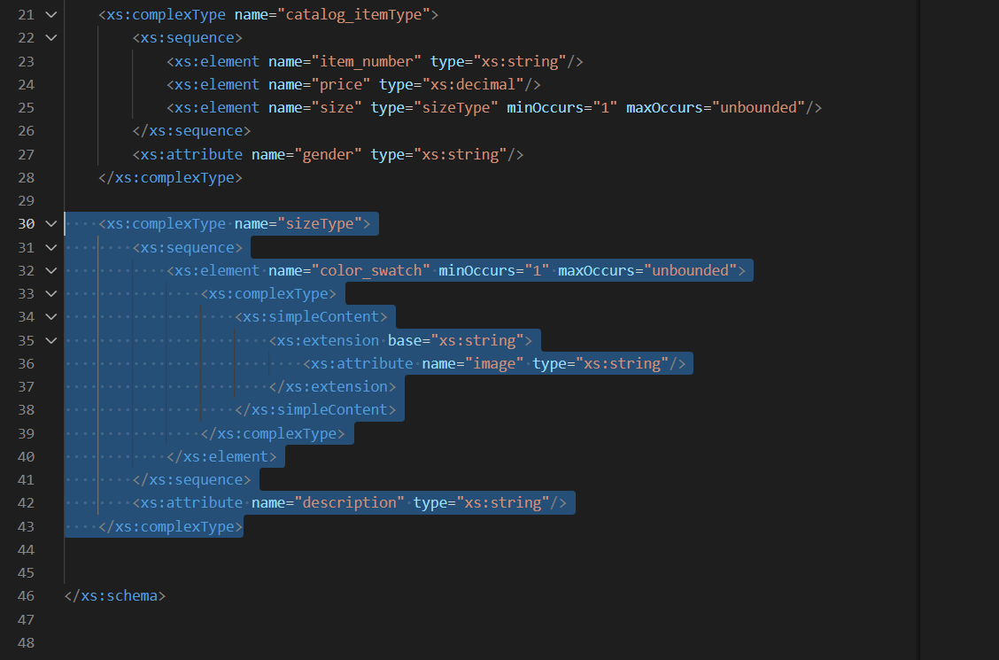

5. Validating the XSD schema

Validation Result

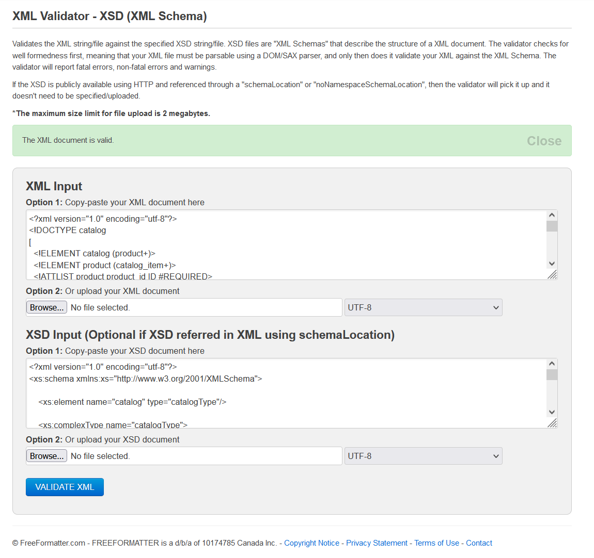