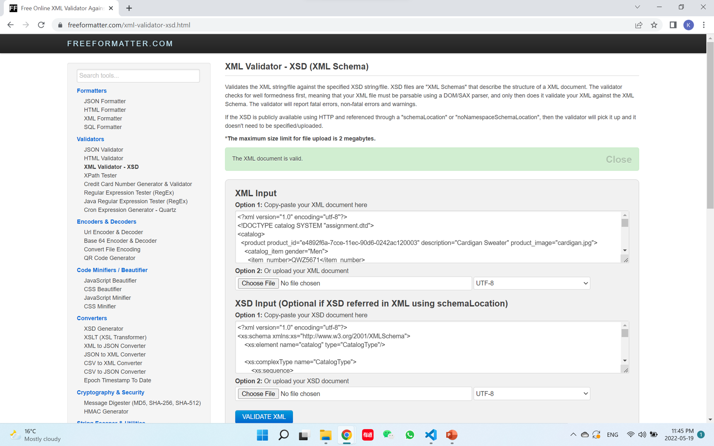

# Kaiyan Chen, N01489178

DTD：
1. start from root elememt, and then add the each child element if there is any
2. add cardinality if necessary
3. add attributes of each element, decide which type depends on the xml, and what kind of default value it is

XSD:
1. start from root element, check if it is simple element or complex, use complexType if it contains other elements or with attributes
2. list the simple elements directly with its name and type, or find what are contained from complex elements and list them all
3. add occurrence according to xml
4. add the attribute of each element, for those simple elements with attributes, cast into complexType in advance

