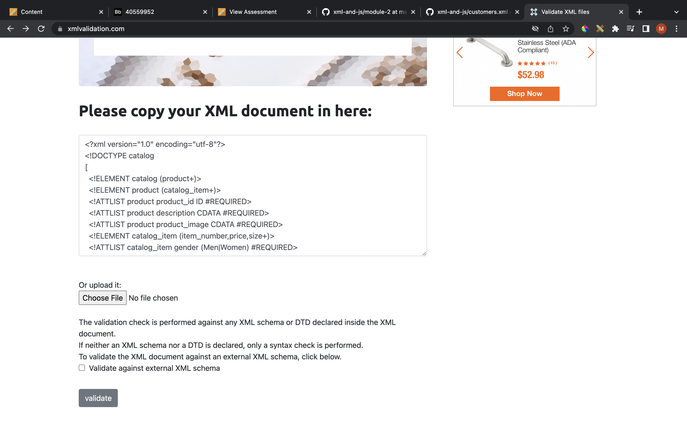
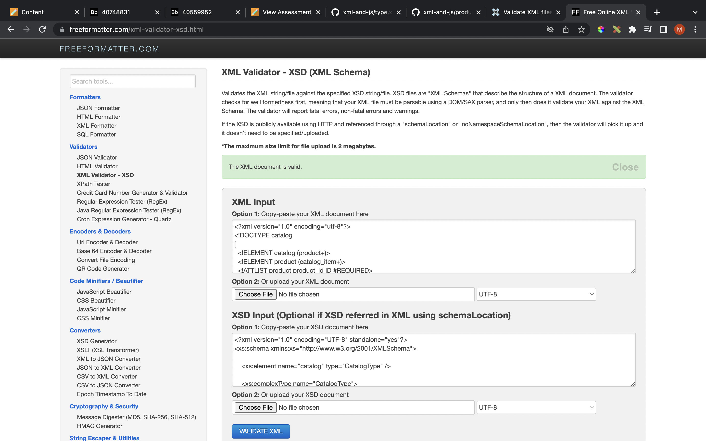

1. Open `module-3/assignments/assignment.xml` in your editor - `DONE`

2. Create DTD for this file and validate it using any of the tools we used - `DONE`

`Inline DTD Created `

`Validation Result`

3. Create XSD for this file and validate it using any of the tools we used

`XSD File Created`

`Validation Result`

4. Explain your thought process for these 2 declarations

`DTD`

- Datatypes are less
- Difficult to read because of complex syntaxes or rules
- Attribute validation for attr values which have multiple words is not allowed  ( For example: "Extra Large" was not allowed in ATTR tag's enumerated list as there was a space )
- Have fewer lines of code compared to XSD, hence less readable 
 
`XSD`

- Easy to read, write as there are no confusing syntaxes or declarations
- Similar to XML syntax, code structure looks neat and organized
- Attribute validation for attr values which have multiple words is allowed in XSD unlike DTD
- Have more data types for attributes as well as elements
- Separates simple and complex elements
- Have more lines of code compared, hence more readable

