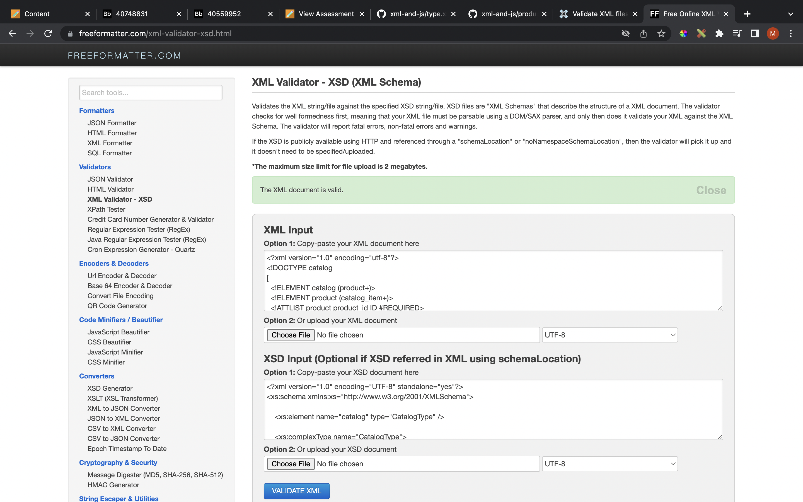

# Assignment 3

# Name : Viraj Chandubhai Paneliya
# ID : N01512139

1. Open module-3/assignments/assignment.xml in your editor
2. Create DTD for this file and validate it using any of the tools we used

3. Create XSD for this file and validate it using any of the tools we used

4. Explain your thought process for these 2 declarations
- DTD file :
- for external dtd we need to specify <!DOCTYPE catalog SYSTEM "assignment.dtd"> line in xml file where assignment.dtd is external dtd file.
- element which consist other elements inside them are written as <!ELEMENT catalog_item (item_number,price,size+)> where catalog_item is element which consist item_number, price and size inside itself.
- other elements which does not consist another element in them are defined as <!ELEMENT item_number (#PCDATA)> where item_number is element and #PCDATA is datatype for all kind of text data input (numbers and alphabates are not considered different in dtd file).
- for occurance of element there are 3 signs to specify that
- '*' for 0 or more occurance
- '+' for 1 or more occurance
- '?' for 0 or 1 occurance
- without above sign element can have only 1 occurance not less or more than 1.

- XSD file :
- each element of xml file are written in <xs:element name="<element>">
- we can add occurance of that element as minOccurs="", maxOccurs=""
- type of element can be added as type="xs:string" (here string, integer, float are considered as different type which is different than dtd file)
- if element has some other elements inside it then it is called as complextype and other elements are written inside <xs:complexType> ... </xs:complexType>
- elements which are not complex type is need to define their type and can be written in self closing tag. for ex. <xs:element type="xs:string" name="item_number"/>

