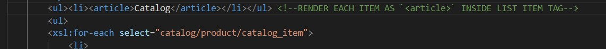
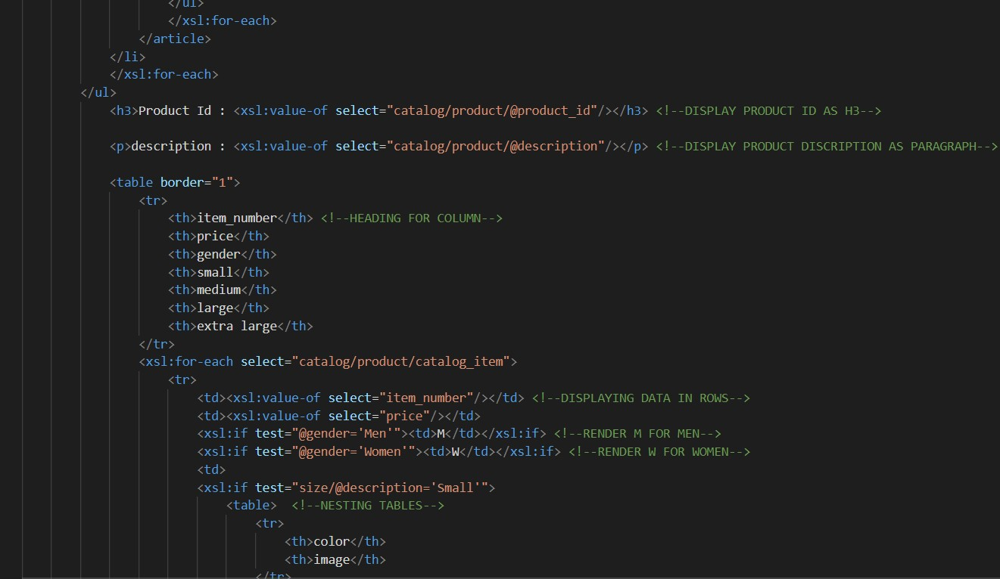
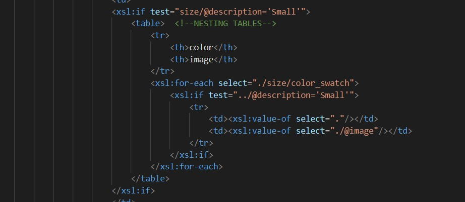

# Assignment
# Name - Mohit Marwaha
# HUMBER Id - N01491713

1. Open `module-4/assignments/assignment.xml` in your editor
2. Create xsl file and add link to it
3. Display catalog in the following way

- main title is "Catalog"
- use html list tag to display catalog

- render each item as `<article>` inside list item tag

- display product id as h3

- display product description as paragraph

- render table of catalog items with columns: item number, price, gender, small, medium, large, extra large (if column item is not present in item, then display empty cell)

- for gender column render M for Men, W for Women

- inside size columns (small, medium, large, and extra large) display subtable with 2 columns: color and image

Create `module-4/assignments/assignment_YOURNAME.md` and explain your thought process in it. Add screenshots of each step to the file

- It was not something which i did earlier as a lot of brainstorming took place while creating the files as the data was in nested form also and as long as rendering m for Men and w for Women is concerned so it required conditions like if. So, overall experience was good and the learning curve is also increasing. 

(Refer `week-1/assignments/evaluation-1.md` on how to add image to md file)
