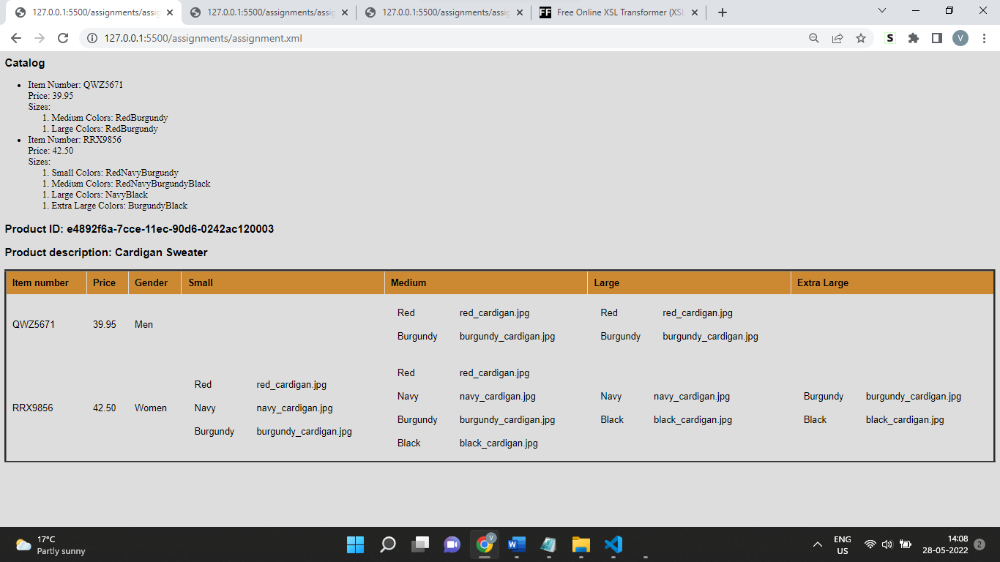

<!--Thought Process-->
-The process of xml and xsl file like to use it as stylesheet 
-Create a XSL file link it , design it as you want to view like in case of HTML 
-Refering to previous examples w3 schools were helpful
Checking the xpath for select option was iterative while Checking and selecting
-Following the examples in lectures 
working on xsl and finding the path were iterative process 
in order to align and use the repititative aspect of the work for-each loop was effective
-I used XML notepad++ to understand the xml tree structure and make changes in XSL file accordingly
the structure inside of html was similiar and was able to generate the table as required
-Additionally <Style> aspect allowed any inline styling experiment in xml file 
refering to w3 examples were helpful and enabled to verify and rectify mistakes occured initally
Output file has been generated as assignment_output.html

-Below is the image of steps taken respectively

<!--Images uploaded -->
0.
1.
2.
3.
4.
5.
6.
7.
8.
9.
