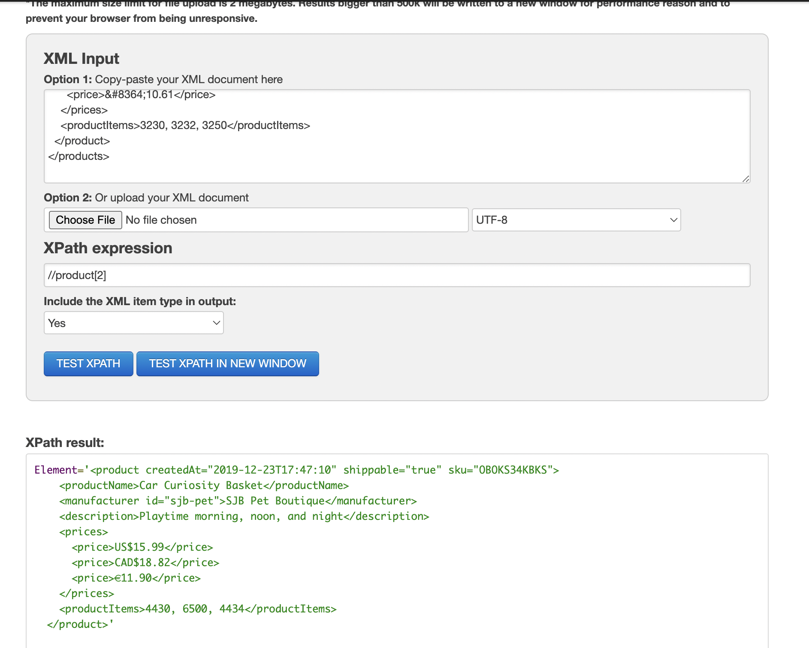
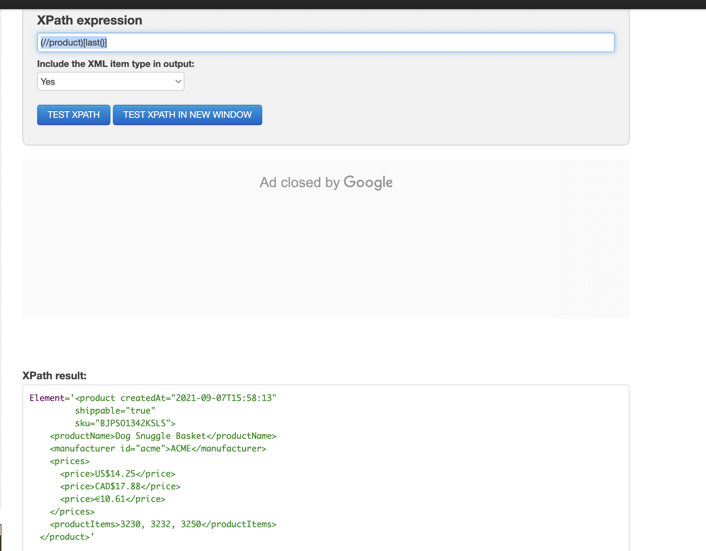
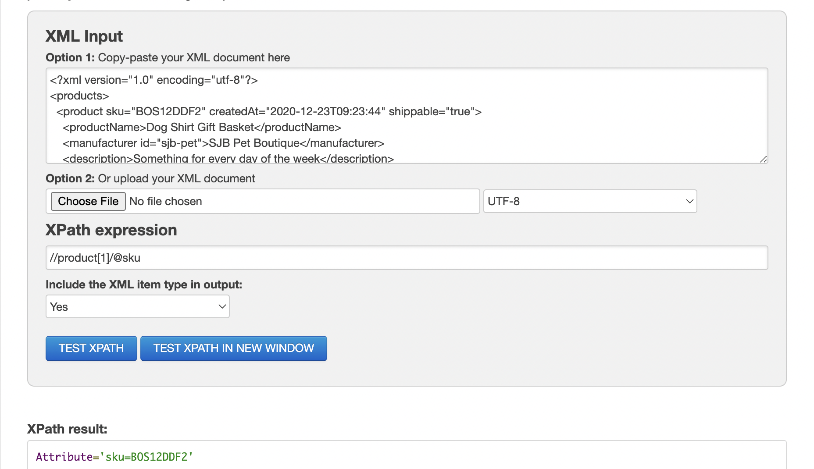
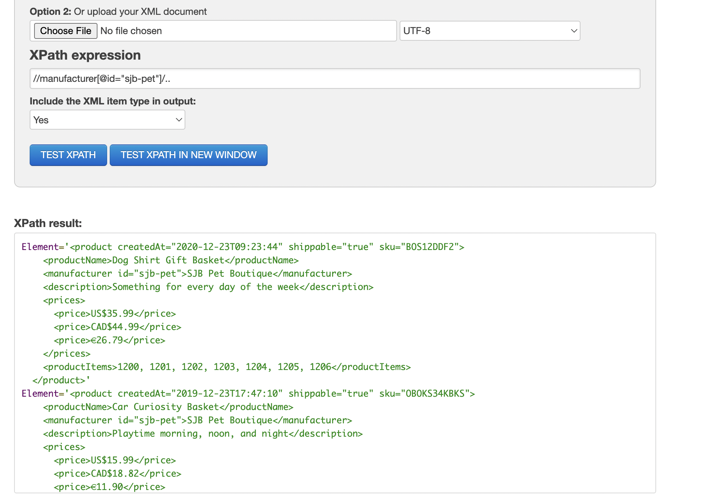

# Activity 1

Generate folowing XPath queries for `module-4/products.xml` file

1. Target 2nd product in the list

`//product[2]`

2. Target last product in the list

`(//product)[last()]`

3. Target `sku` attribute of the first product

`//product[1]/@sku`

4. Target all products with manufacturer id `sjb-pet`

`//manufacturer[@id="sjb-pet"]/..`

