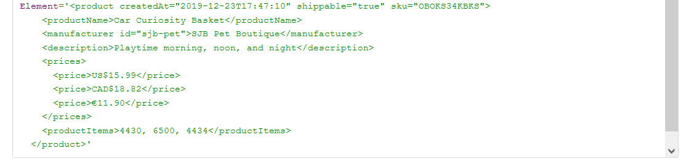
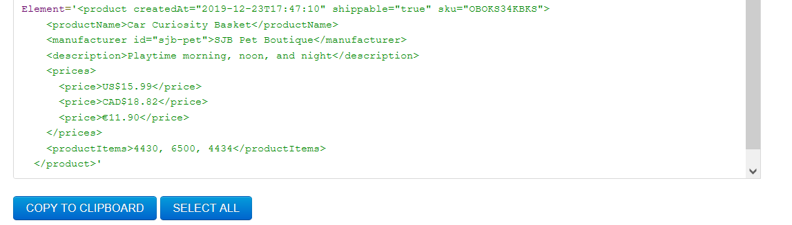

# Activity 1

1. Target 2nd product in the list

//product[2]

2. Target last product in the list

//product[last()]

3. Target `sku` attribute of the first product

//product[1]/@sku

4. Target all products with manufacturer id `sjb-pet`

//product[manufacturer[@id='sjb-pet']]

OR 

//product/manufacturer[@id='sjb-pet']/..

