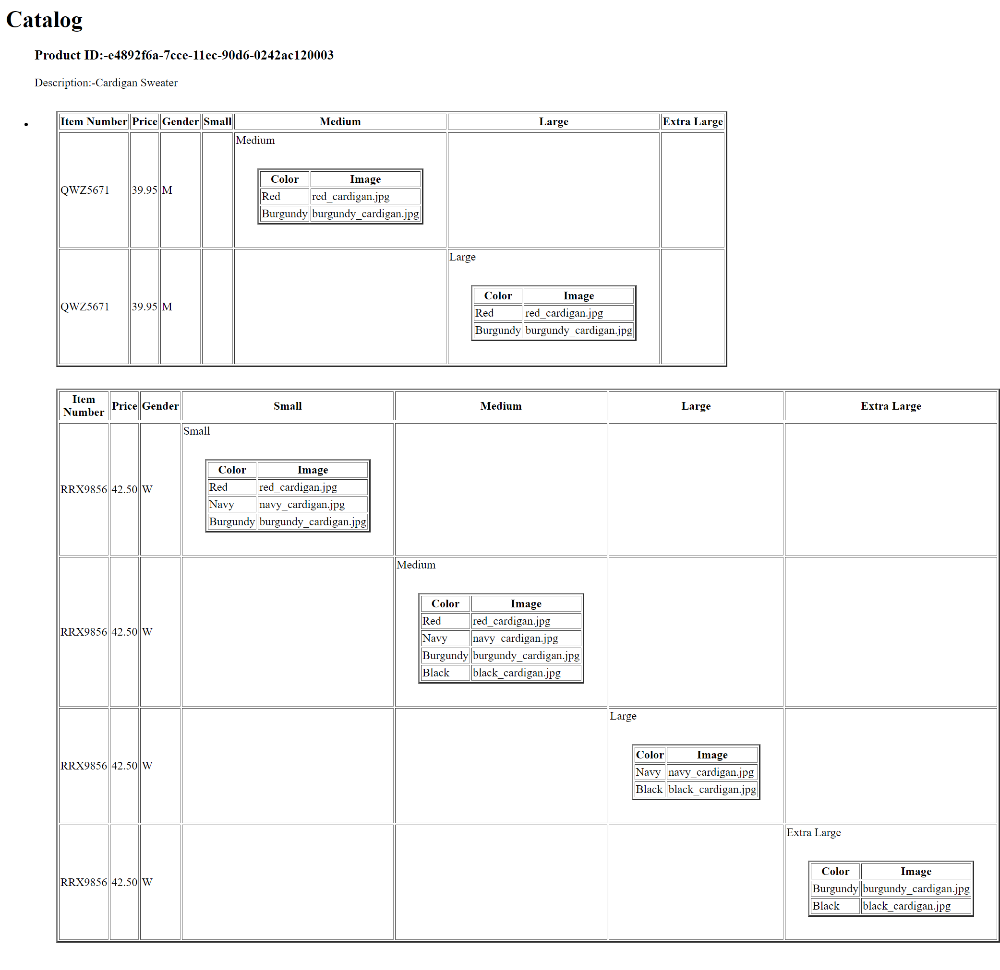

1.  

-   The styling document for xml document is XSL language.XSL is somewhat similar to css just like it is an stylesheets file for XML document.XSL also have functionality same as CSS but it is syntax is different and its more complex and less scalable as compared to CSS. 