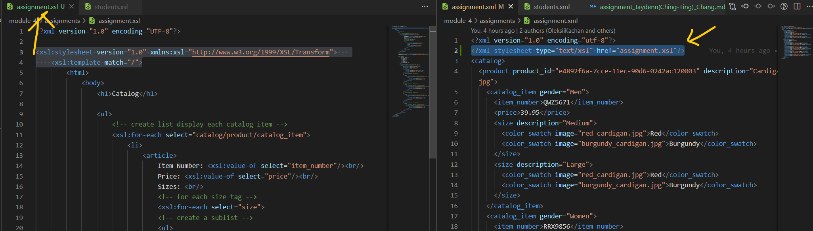
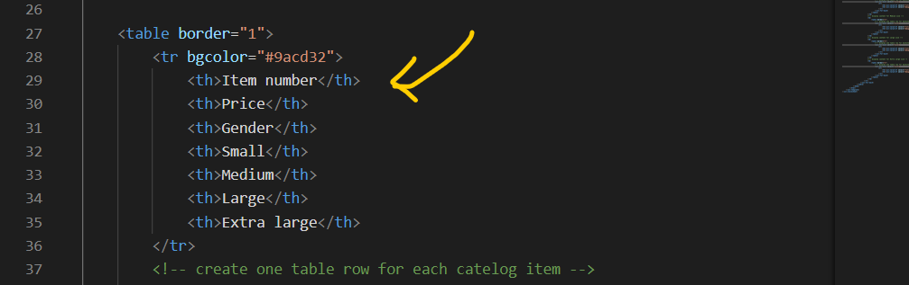
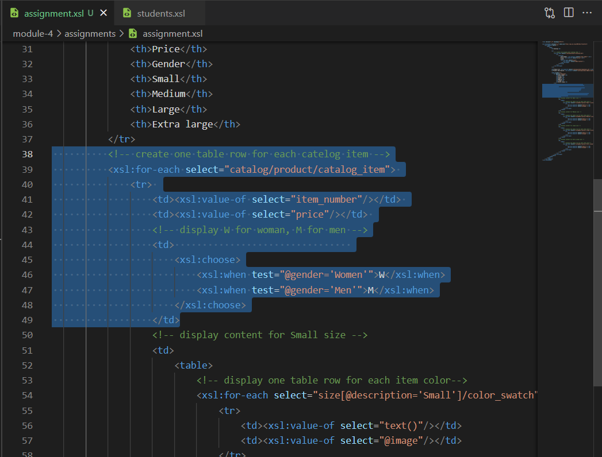
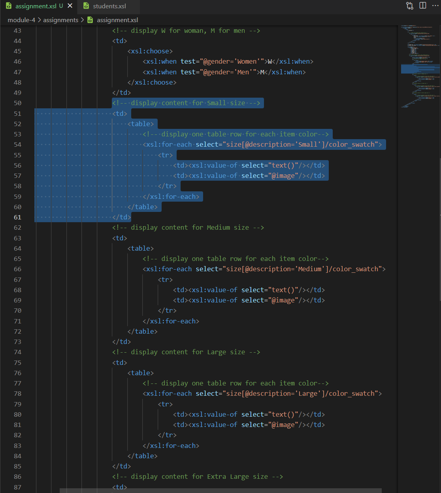

# Assignment

1. Link xml to the xsl file

2. Create main title "Catalog", and a list displaying each item.

3. Create h3 product ID and p product description. 

For product ID, use xpath to grab the attribute product_id from product tag. Full xpath = //catalog/product/@product_id

For product description, grab the attribute description from product tag. Full xpath = //catalog/product/@description

4. Create a table, and add table headers.

5. Create the row for the first three column: item_number, price, and gender.

First, we are only writing one row, so we need a for-each tag so the browser will go through each catelog_item under product tag.

For item number, we select the item_number under catalog_item. Full xpath = //catalog/product/catalog_item/item_number

**Apparently xsl will automatically add a / in the beginner of the select content.**

For price, we select the price tag under catalog_item. Full xpath = //catalog/product/catalog_item/price

For gender, we want to output different text based on the attribute, so here I use xsl:choose (case switch) statement. When the attribute gender equals to Women, output W, and when it's Men, output M. Here I assume the xml will always provide the gender as either Women or Men.
The xpath to gender attribute = //catalog/product/catalog_item/@gender

**The test tests the attribute content against the condition and gives a boolean result**

6. 

7. 

8.  

 

