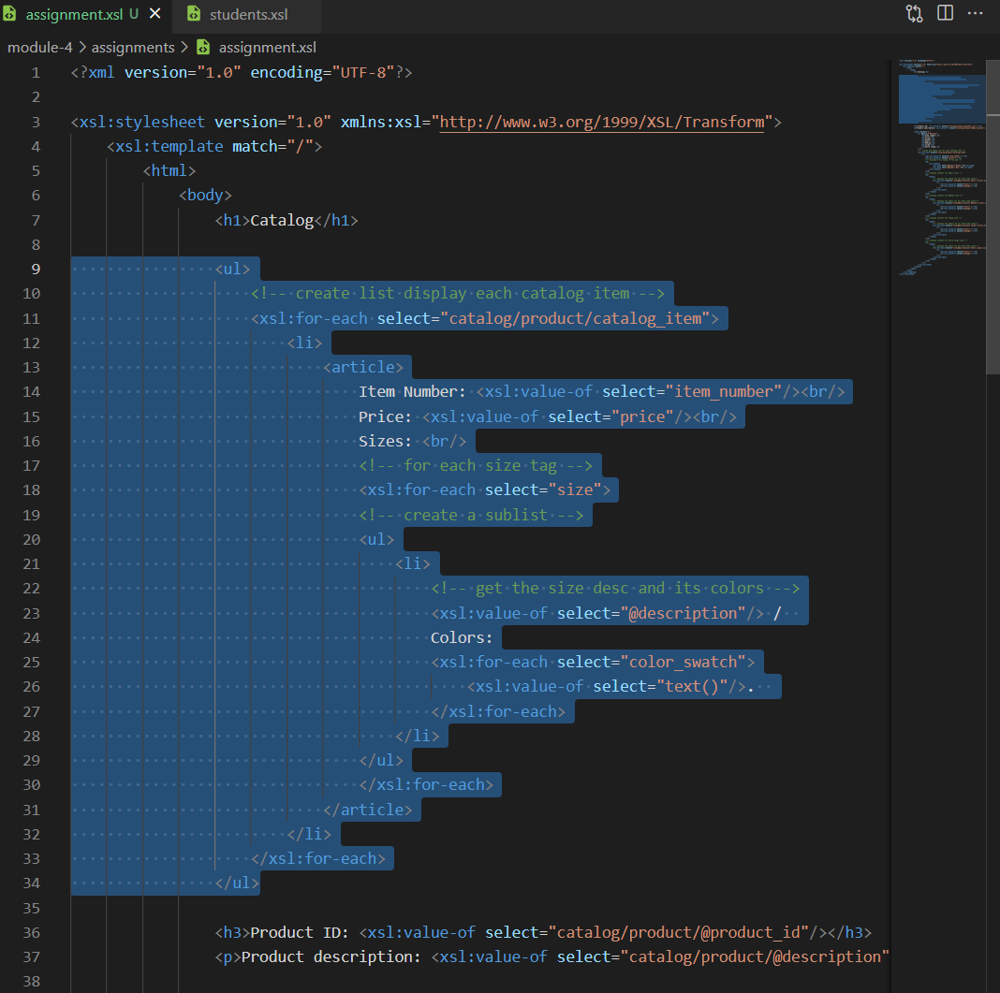

# Assignment

### 1. Link xml to the xsl file

### 2. Create main title "Catalog", and a list displaying each item details.

Create an unordered list. Inside the list, for each catalog_item, create a li to include item details.

Grab the item number. 

The xpath = //catalog/product/catalog_item/item_number

Grab the price. 

The xpath = //catalog/product/catalog_item/price

To display all sizes and their colors, go through each size to grab the description attribute, and then move under one level to go over each color_swatch to get the color. 

The xpath to size description = //catalog/product/catalog_item/size/@description

The xpath to the color = //catalog/product/catalog_item/size/color_swatch

### 3. Create h3 product ID and p product description. 

For product ID, use xpath to grab the attribute product_id from product tag.

Full xpath = //catalog/product/@product_id

For product description, grab the attribute description from product tag. 

Full xpath = //catalog/product/@description

### 4. Create a table, and add table headers.

### 5. Create the row for the first three column: item_number, price, and gender.

First, we are only writing one row, so we need a for-each tag so the browser will go through each catelog_item under product tag.

For item number, we select the item_number under catalog_item. Full xpath = //catalog/product/catalog_item/item_number

**Note:** Apparently xsl will automatically add a / in the beginner of the select content.

For price, we select the price tag under catalog_item. Full xpath = //catalog/product/catalog_item/price

For gender, we want to output different text based on the attribute, so here I use xsl:choose (case switch) statement. When the attribute gender equals to Women, output W, and when it's Men, output M. Here I assume the xml will always provide the gender as either Women or Men.
The xpath to gender attribute = //catalog/product/catalog_item/@gender

**Note:** The "test" tests the attribute content against the condition and gives a boolean result

### 6. Next, is to create content for the small size column. To create a subtable, add table inside td.

Then, to iterate through each color_swatch under size attribute filtered to Small. 

Full xpath = //catalog/product/catalog_item/size[@description='Small']/color_swatch

For each color_swatch, grab the text of the tag and the content inside image attribute.

Full xpath to text = //catalog/product/catalog_item/size[@description='Small']/color_swatch/text()

Full xpath to image attribute = //catalog/product/catalog_item/size[@description='Small']/color_swatch/@image

### 7. Apply the same contents to medium, large, and extra large sizes.

Change the test condition  respectively.  

### 8. The output.

