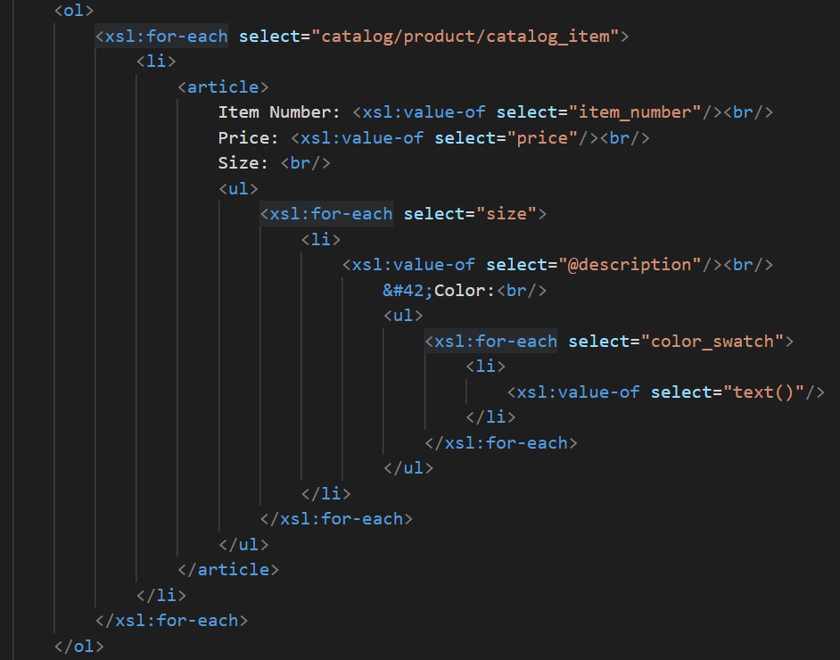
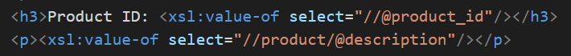
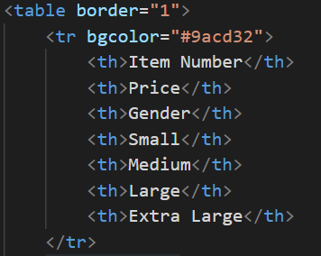
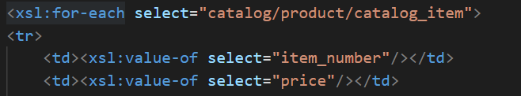
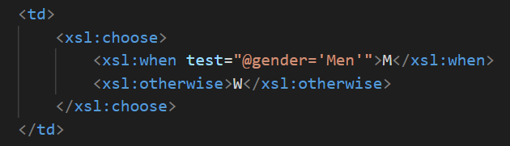
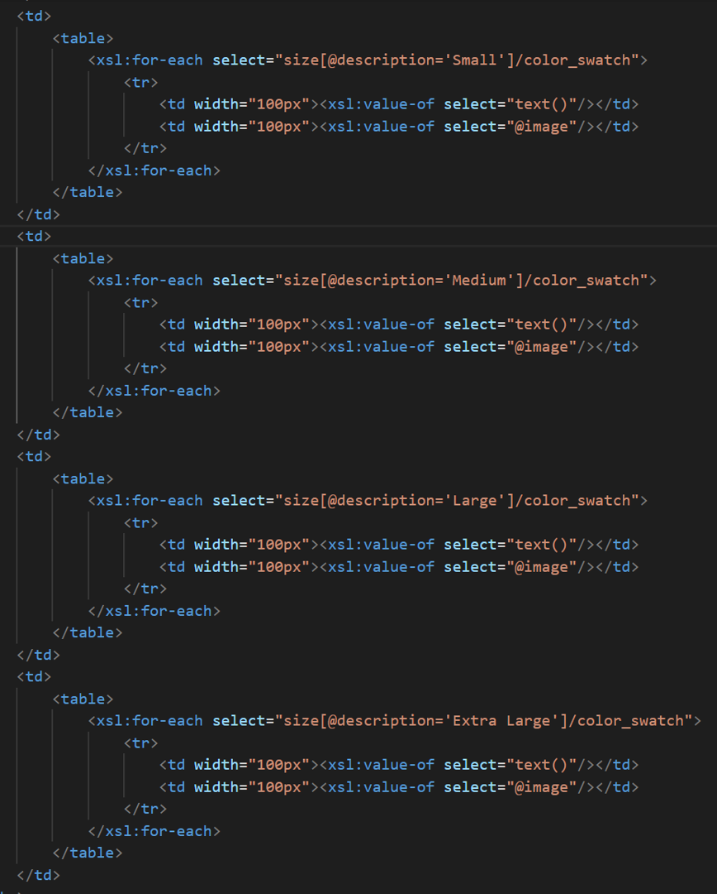

1. use `<h1>` inside for main title "Catalog"

2. use `<ol>` to create ordered list of each catalog item, and use `<article>` to wrap item number, price, size and color as one list item, for those with multiple elements such as size and color, use `<xsl:for-each>` and `<xsl:value-of>` to select the values and display in unordered list

3. add product id and description by using `<h3>`,`
` and `<xsl:value-of>`

4. use`<table>` and `<tr>` to add the table with border=1, the first table row as header in bgcolor=#9acd32, list each item as requested by `<th>`

5. use `<xsl:for-each>` and `<xsl:value-of>` to display the data of item number and price

6. use `<xsl:choose>` to display the gender with M and W

7. create subtable inside `<th>` of each size column, using `<xsl:for-each>` to select the corresponding data(color and image), and set the width to 100px
