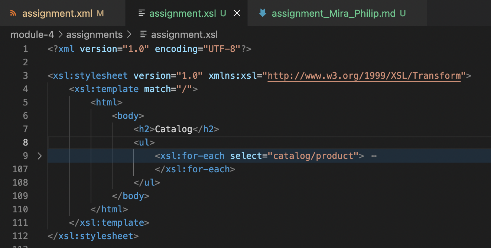
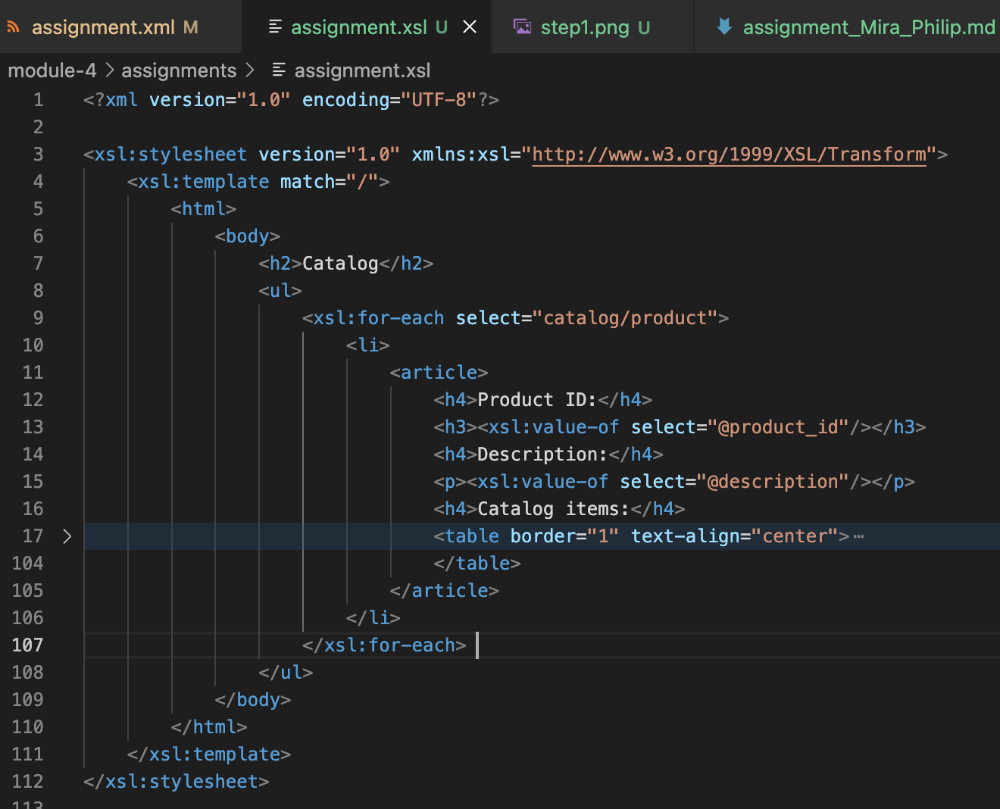
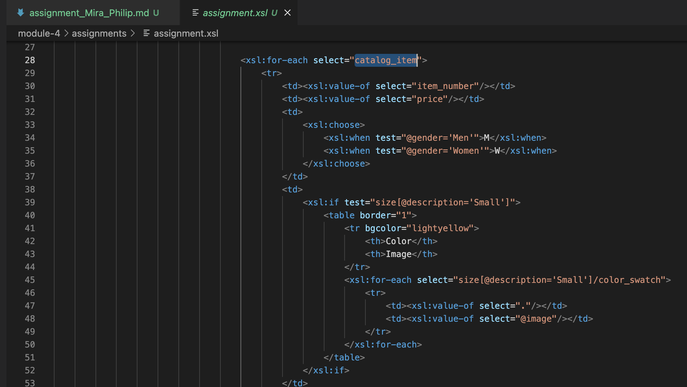
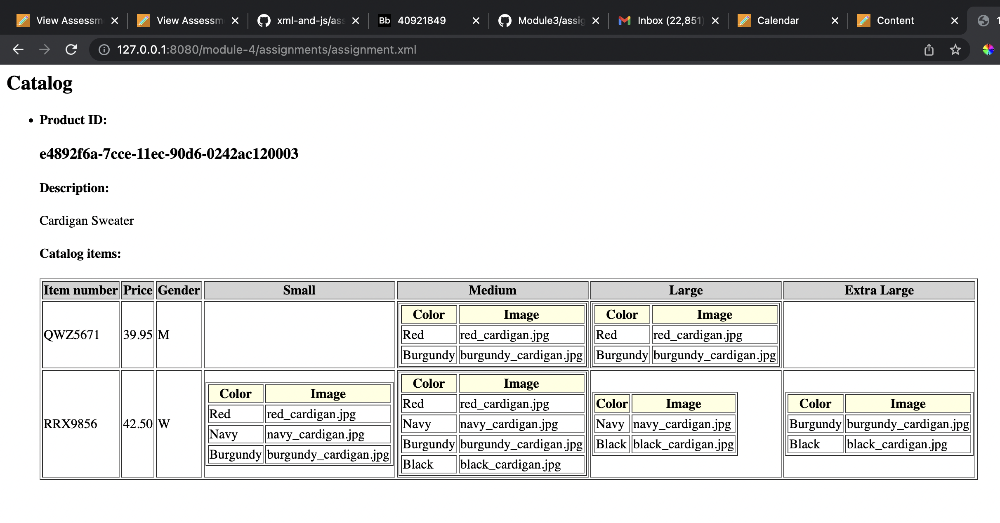

`My thoughts on xsl in general :`

1. Complex XMLs become more readable with the help of XSL and thereby making it easier to demostrate it to people without technical knowledge
2. Similar to XML syntax
3. Easy to learn and write xsl code for someone who has a basic understanding of how HTML/CSS works.
4. Helps in learning/understanding how Xpath works

`How I created the xsl file ?`

`Step 1`

Identified that Catalog can contain multiple products  
Main Heading ("Catalog") --> h1 tag --> "Catalog" (Xpath --> /)  
List of products --> ul tag --> with xsl:for-each  (Xpath --> catalog/product)  

`Step 2`

Identified that each product has product id, description and catalog items    
Product details rendered using --> article tag with content as shown below    
Product id rendered using --> h3 tag --> getting attribute value through --> @product_id     
Product description rendered using --> p tag--> getting attribute value through --> @description    
Catalog items rendered using --> table tag --> catalog_item element name  

`Step 3`

Identified that each product's catalog items has item number, price, gender and available sizes (in multiple colors with image)  
Item number rendered using --> td tag --> item_number element name   
Price rendered using --> td tag --> price element name   

Gender rendered as "M" or "W" using --> td tag and xsl:choose to switch based on "Men" or "Women" --> @gender attribute value  

Sizes available rendered using another --> table tag combined with xsl:if test="size[@description='Small']">m--> to display empty cells for unavailable sizes  

Multiple colors rendered using --> tr --> with xsl:for-each select="size[@description='Small']/color_swatch", used Xpath . and @image to fill data inside cells  

Repeated the above 2 steps for every size (S,M,L,XL)  

`Step 3`

Final output rendered using http-server  

