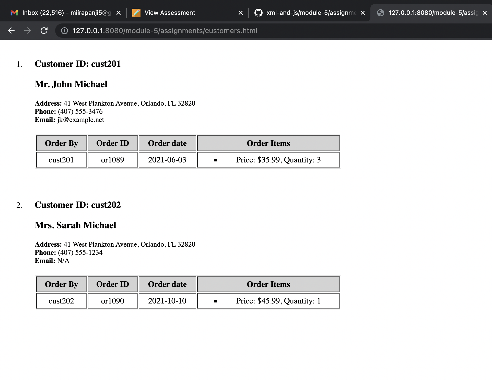

# Assignment

- Create empty html file `- DONE`
- Create empty script tag `- DONE`
- Read data from `customers.xml` `- DONE`
- Create function to render customers from loaded file into html in any format (it can be a table, or a list, or just plain divs) `- DONE`

