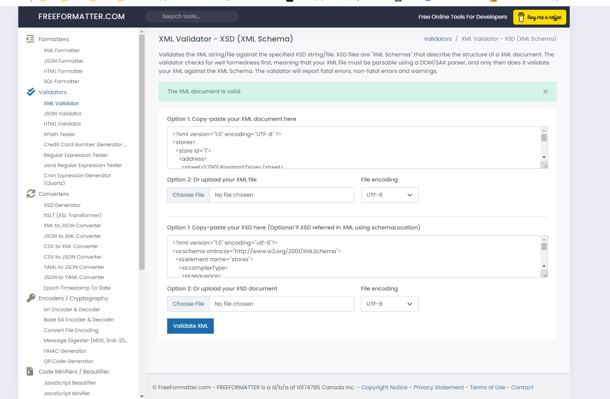
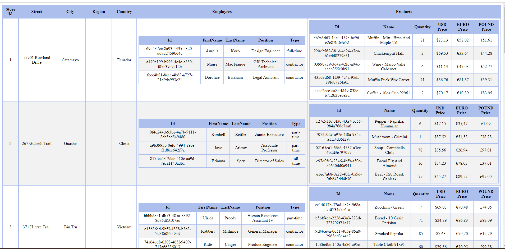

# Project 1
# Garima Wadhwa
# n01552997

1. 
2. 

- I worked on retail.xsd and retail.xsl file in this project using retail.xml
- In xsd, provided details such as ocurrence count,data types of the element, attributes of the elements in the xml file.
- In xsl, used HTML tags of <table>,<tr>,<th> to present the data in a table format having columns and rows.

