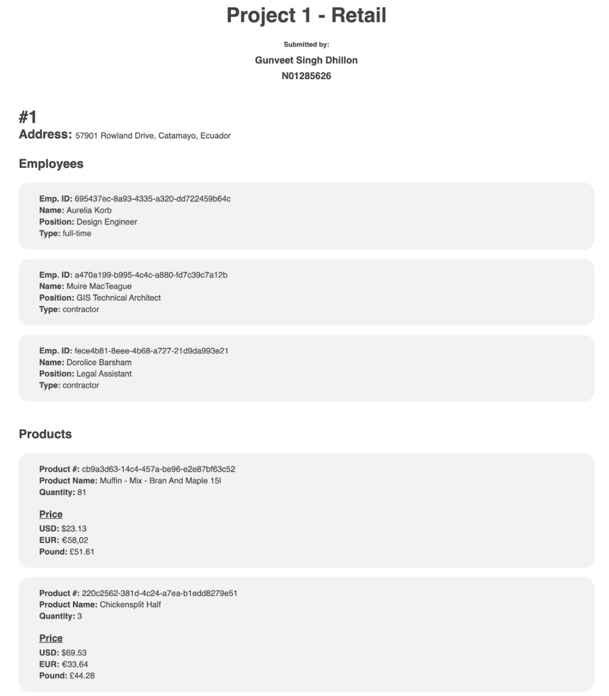

Gunveet Singh Dhillon
N01285626

I've created the following for this project:

1. An XML file 'retail.xml' from the given JSON file.
2. An XSL file 'retail.xsl' which outputs the data present inside the XML file using Unordered Lists. I could have used the Table, but I found Unordered List a better option for such kind of output.

