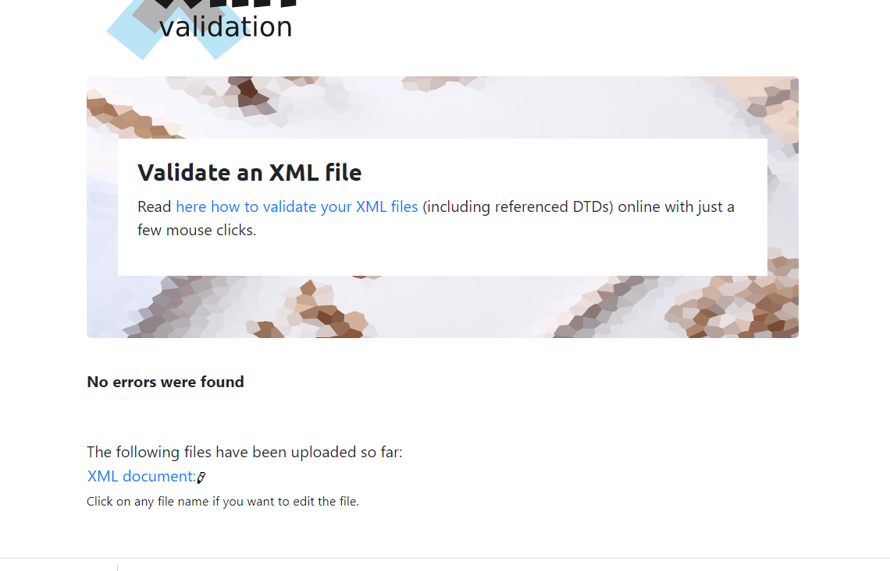

The main objective of the project part 1 was to create xml from json and then create DTD, XSD, XSLT and HTML to display given Data of airlines .
First, I converted data from JSON to XML so that later part could be followed by it. 
I did below work on this project:

- First, I created DTD for the generated XML data.
  

- I also created XSD file and validated both the xml and xsd file.
  