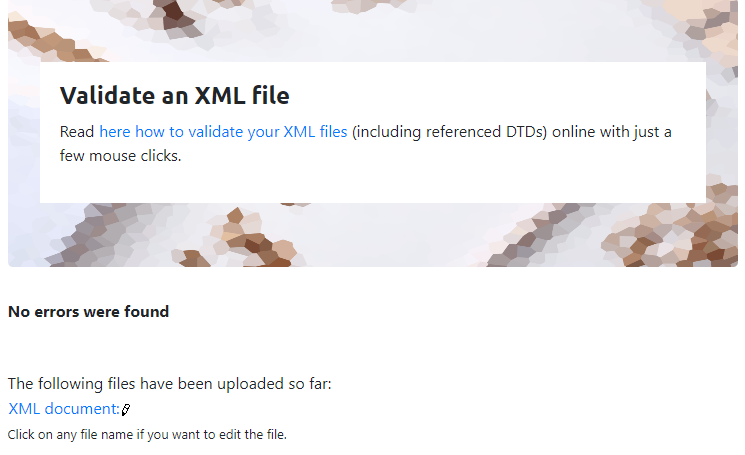
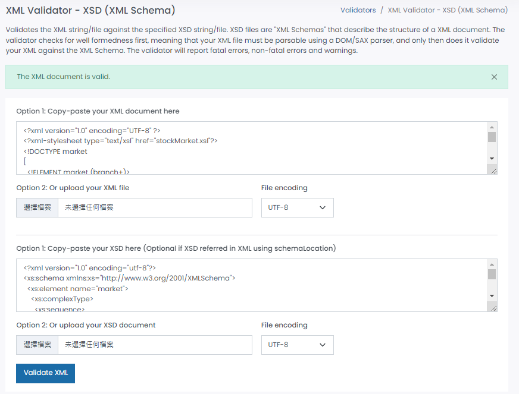
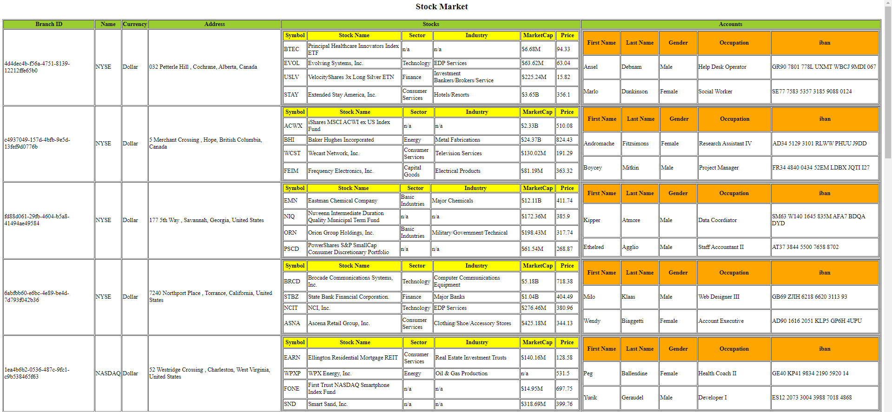
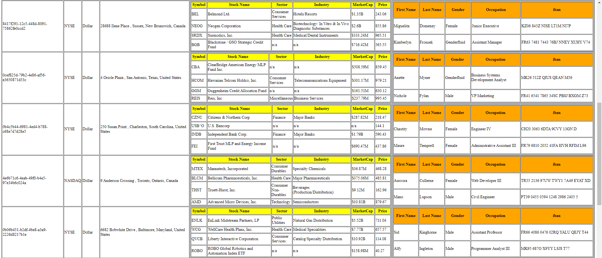
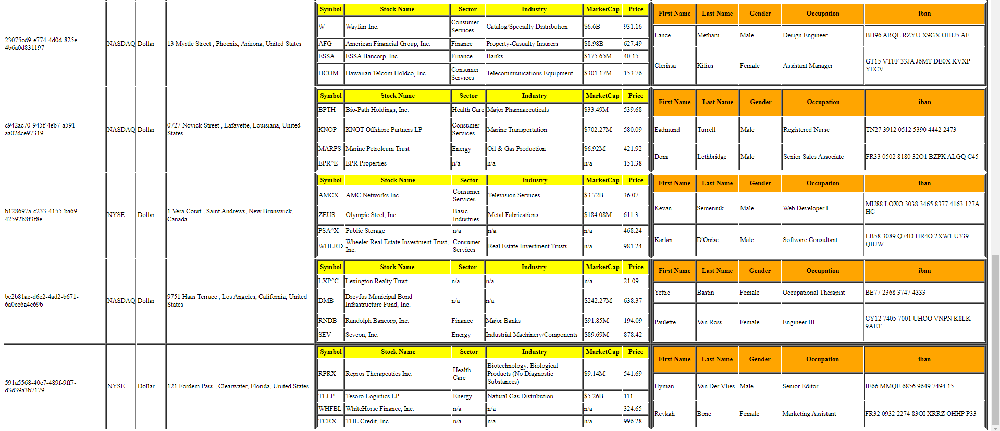

# Project 1

Student Name: Ka Hang Chan 
Student Number: N01530146

In project 1, I am responsible to type declarations (create dtd and xsd for the xml file) and create xslt to display data in table format.

1. Types declarations
- I created an inline dtd in the stockMarket.xml file that Long Teng created.
- I created stockMarket.xsd for the xml file.
- Validation for stockMarket.xml (included inline dtd): 
 
- Validation for stockMarket.xsd: 
 

2. Create xslt to display data in the table format
- I created stockMarket.xsl for the xml file.
- I displayed the data in the table format.
- I displayed subtable in each of the data cells of the colums of Stocks and Accounts.
- Output:  
 
 
 