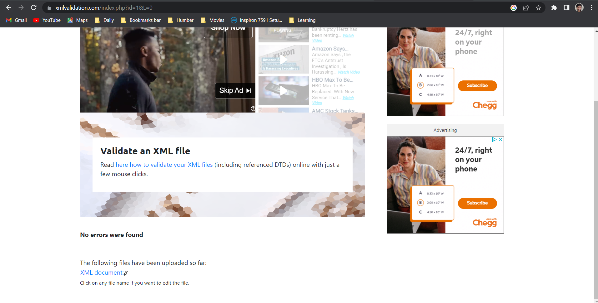
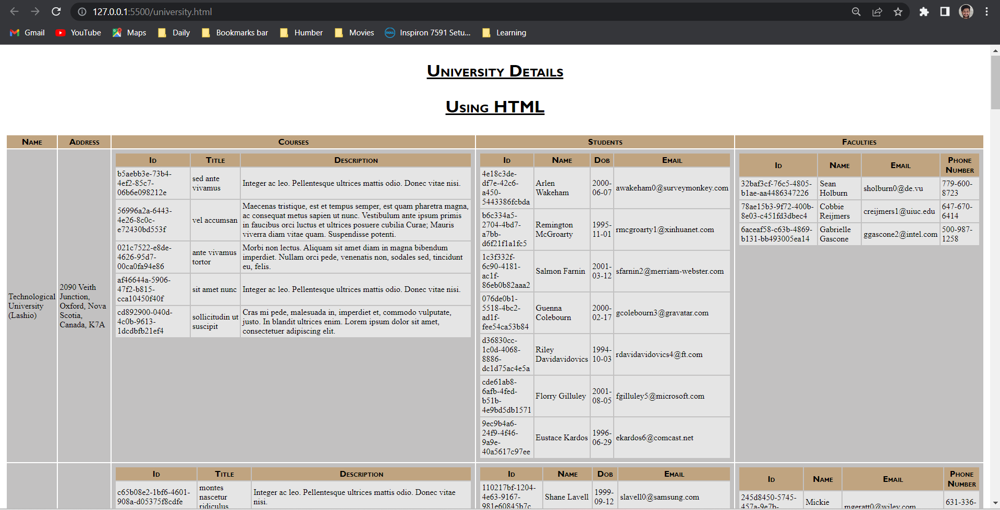

The main objective of this project part-1 was to able create xml from json and then create DTD, XSD, XSLT and HTML to display and structure the given Data of universities and display it in tabular form in the browser to make it more readable. First, we converted data from JSON to XML file to understand and decide the later workflow. The later parts or work i did on this project is as follows:

- First, I created DTD for the generated XML data.
  

- I also created HTML file and dynamically loaded the given XML data into this HTML using JS and displayed it in browser in a tabular form using the same CSS as XSLT.
  
