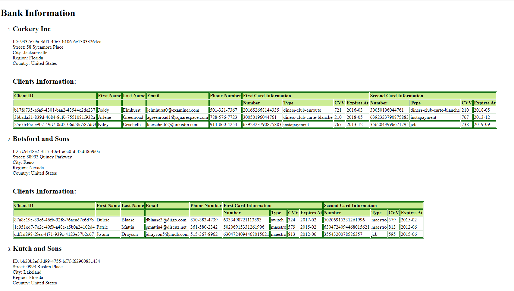
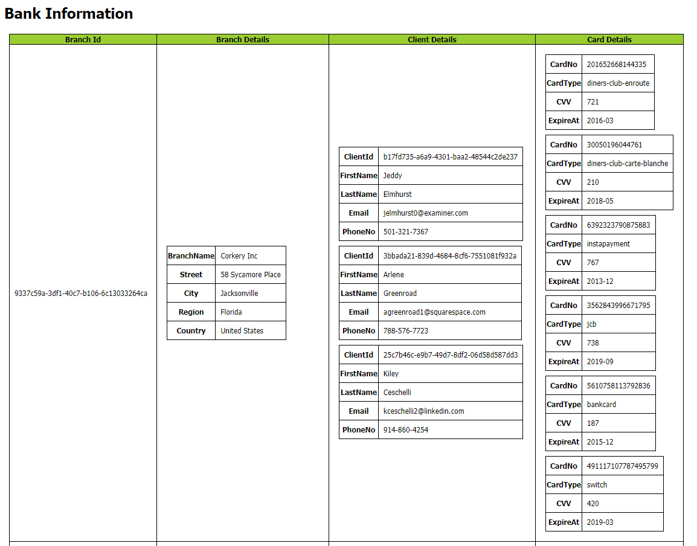

Contribute in this project (Topic: bank):

I'm responsible for creating files XSD and XSL, but after I creating XSL file I have to use the XML file from my team member. So I need to modify and redesign the XML file to link the stylesheet with the XSD file to display data in the table format, change certain element names, and also added the DTD declarations

XSD File:
I created the XSD file that specifies the structure of different types of elements that will be used in the XML document. For example, the banks element is defined as a complex type that can contain multiple branch elements, each of which is defined as another complex type that can contain multiple clients and cards elements. 
Within each complex type, I defined the child elements that make up that type. For example, within the branch complex type, I have child elements such as id, name, street, and city, which correspond to the different fields of information that we want to represent for a bank branch.

XSLT:
I created the XSLT that transforms an XML file containing information about bank branches, clients, and their credit cards into an HTML table that displays the information in a formatted way. The resulting HTML table has 4 columns: Branch ID, Branch Details, Client Details, and Card Details. Each row in the table corresponds to a branch in the XML file and includes information about the branch, its clients, and their credit cards. The XSLT code uses various XSLT elements such as xsl:for-each, xsl:value-of, and xsl:template to transform the XML data into the desired HTML format.

Screenshot:

