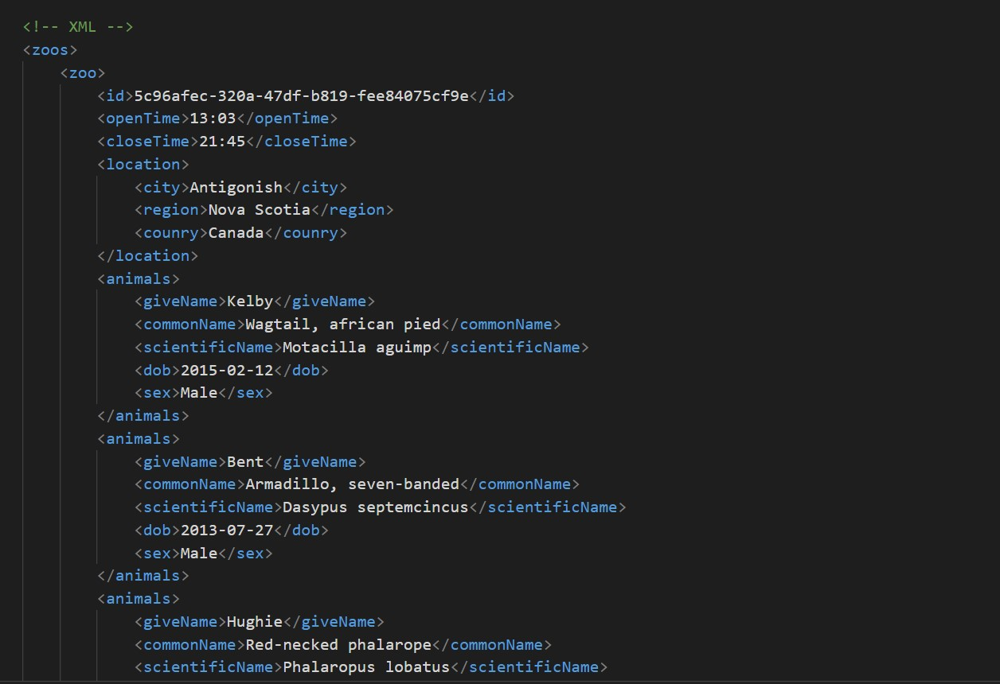
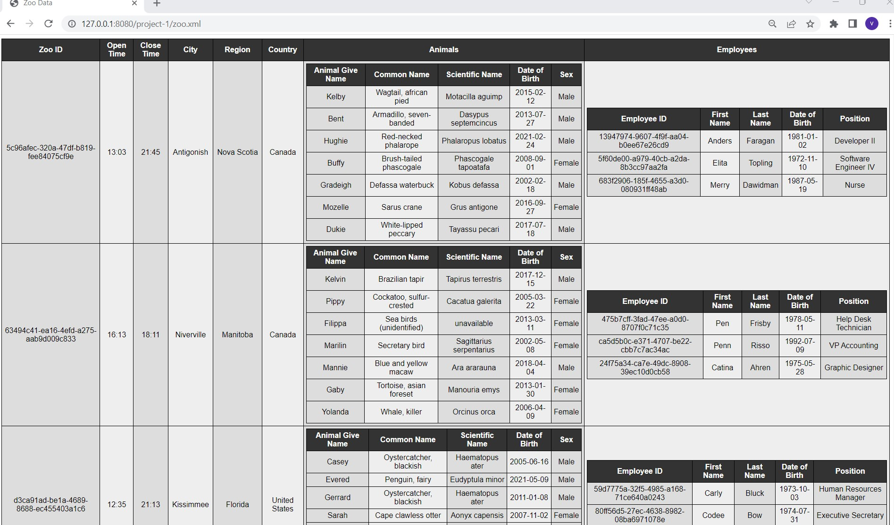

# Project Explanation in brief

->Here in this project we have json file of zoo and zoo.json file contains lots of data object and array of objects. So in this project we have to first analyse the json file and create and design xml file along with DTD. Although the json file is too big and its hard to design xml,but we tried best to design the file. After that create XSLT and html file along with javascript code in order to load dynamically load data from your xml into html. So here the main goal is to create xml file from json and then create DTD,xsd,xslt and html file to display data in proper format.

# My contribution in this project

- first I created and design xml file from json

- second i created zoo.xsl(Created xslt) in order to display data in tabular format
