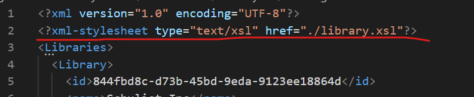

# Project - 01

- Name: Wenhao Fang
- Id: n01555914
- Contribution: Create `xslt` to display data in the table format, based on the xml file created by Meghna.

---

1. Analyze XML architecture

   - XML file has 15 `<Library>` elements which contain detail information about the library.
   - Miltiple `<catalog>` elements exist in each `<Library>` element.

2. Create a `xsl` file and link this file to `xml` file.
   

   

3. Create `<xsl:template>` and html tag using bootstrap as style format.

   

4. use `<xsl:for-each>` to loop each `<Library>` element.

   

5. create a `<table>` tag in which loops each `<catalog>` elements.

   

6. render:

   

   

   
