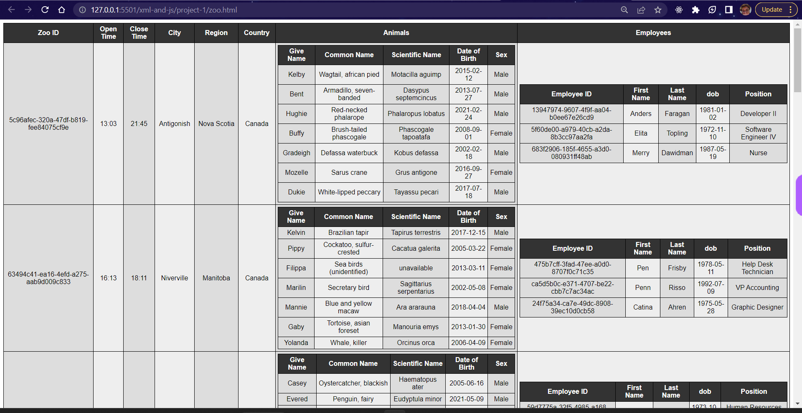

Name: Ronak A. Mangroliya.
Student ID: N01530634

==> My Contribution
# I worked on zoo.html file and css of the project. This is a code snippet that retrieves data from an XML file and displays it in an HTML table. Here is a breakdown of the thought process for the code:

==> The HTML file includes a table element with an ID of "zoo_data", as well as a link to a stylesheet.
==> The JavaScript code starts by creating an instance of the XMLHttpRequest object and defining a function to handle the response. When the readyState is 4 (the operation is complete) and the status is 200 (the response was successful).
==> Two helper functions are defined: stringToNode and create_zoo_data. The first function takes an HTML string as an argument and returns a DOM node. The second function takes a zoo object as an argument and returns a table row DOM node containing the zoo data.
==> The displayData function retrieves the root element of the XML document, then retrieves a NodeList of all the zoo elements.
==> The function then loops through each zoo element, creates a zoo object.
==> Inside this loop, another loop retrieves each animal element and creates an object. This object is added to the animals array of the current zoo object.
Another loop retrieves each employee element and creates an object with properties. This object is added to the employees array of the current zoo object.
==> The create_zoo_data function is called with the current zoo object as an argument. This function creates two tables containing the animal and employee data.
==> When all zoo elements have been processed, the table with the ID "zoo_data" is displayed with all the data from the XML file.

==> dynamically loaded the given XML data into this HTML using JS.
  