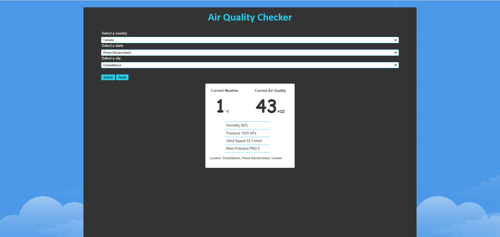

# Project 2 - GROUP 09
## Topic: Air Quality Checker

## Introduction
This project deals with getting weather and pollution data form the 3rd Party API and dynamically loading it into the HTML page.

## Structure
The project was split into 3 parts,
- connecting to the API and getting all the needed data into a variable for use, as well as making other Javascript logic,
- using working with the HTML file and the sourced data to structure the HTML (rendering), and
- styling the HTML with CSS

My responsibility was the second; working with the HTML file and the sourced data to structure the HTML.
First of all, I used the ID to fetch the HTML element.
Stored the weather and pollution data from API to defined variables.
Converted the units of the wind speed
Then I have passed the fetched data into a table with the help of the above mentioned vaariables.
I have used switch case method to show the attributes in the air quality.
"html" variable consists of the data in the table by using the fetched data in the constants and the properties.

## Conclusion
With the way the data is sourced, all the data is presented in the Html page.

