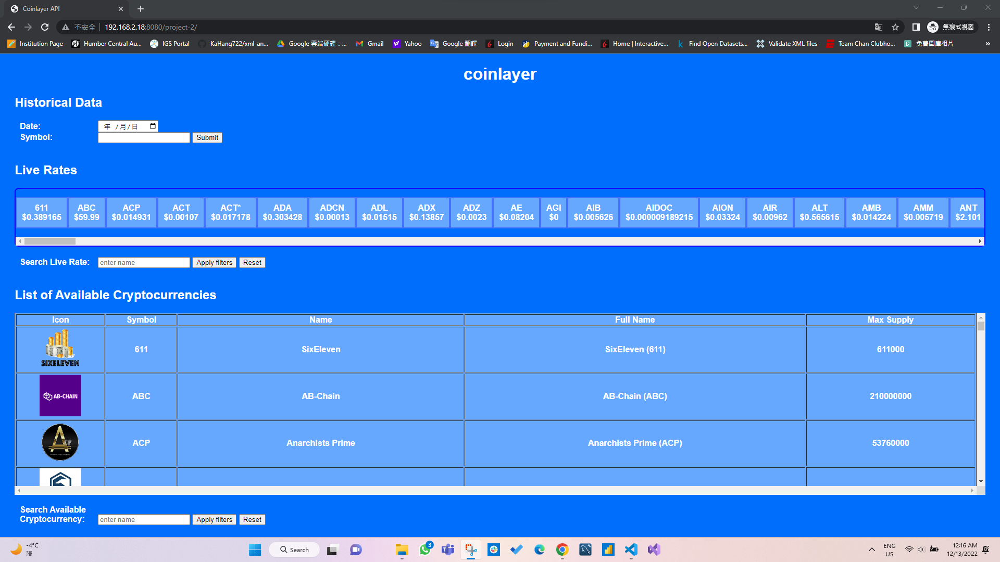
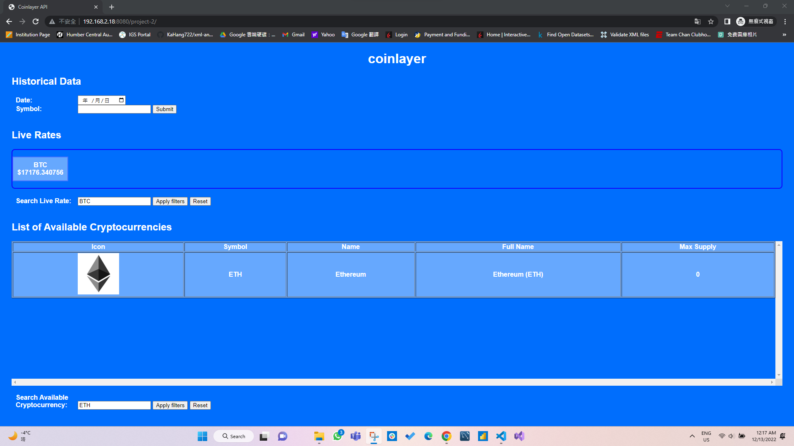

# Project 2

Student Name: Ka Hang Chan 
Student Number: N01530146

- In project 2, I am responsible to design the layout of the webpage(HTML and CSS) and apply the ajax renderer technique into 'Live Rates' and 'Avaliable Cryptocurrenies List'. 
- After fetching the api, the data would be stored in _data and _data2 for the 'Live Rates' and the 'Avaliable Cryptocurrenies List' respectively. We can search a live rate or an info of avaliable cryptocurreny by a specfic symbol from user input, and get the data of that specific symbol without fetching the api again.

- Output: 
 

- When I search a live rate of BTC and search the info of ETH: 
 